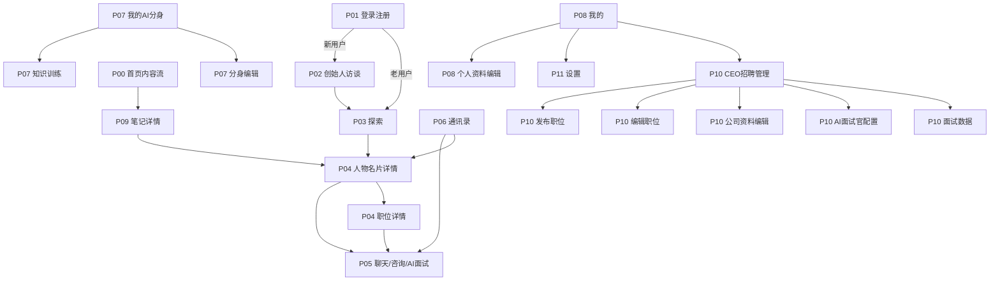

# UI 改版技术交付文档 V1.0

文档版本：v1.0.3  
生成日期：2026-08-02  
最新更新：2026-08-06  
对应原型：`鸥我白盒8.2-改ui-开发需求备注版-GitHub最终交付版.html` 最终交付版  
对应规范文档：`iOS-Android-鸿蒙三端UI适配规则白皮书.md`  
对应业务文档：`首页白盒自动发布PRD.md`、`我的-大脑-数字图书馆PRD.md`  
目标读者：iOS SwiftUI / UIKit、Android Jetpack Compose / View、鸿蒙 ArkTS / ArkUI 开发工程师  
单位口径：iOS 使用 pt，Android 使用 dp/sp，鸿蒙使用 vp/fp；HTML 原型中的 px 按 1:1 映射为逻辑设计单位，原生实现时必须换算为平台单位。

## 第零章：开发必读

以下 10 条为 V1.0.3 开发冻结规则，优先级高于后文中的解释性描述。遇到原型、代码片段和文档局部表述不一致时，按本节执行。

1. V1.0.3 以 HTML 高保真原型为唯一视觉基准：`/Users/erica/Documents/Codex/2026-08-02/10-ui-apple-human-interface-guidelines/outputs/鸥我白盒8.2-改ui-开发需求备注版-GitHub最终交付版.html`。
2. V1.0.3 不提供 Figma / 蓝湖 / 摹客源文件；视觉验收以 HTML 原型截图、Design Tokens 和本文档数值为准。
3. 外观设置只支持三态：跟随系统、浅色、深色；不支持暖色 / 冷色。
4. 所有颜色必须走 token 或平台语义色；禁止在业务页面新增未登记的硬编码颜色。
5. 所有可点击元素必须满足热区要求：iOS ≥44×44pt，Android ≥48×48dp，鸿蒙 ≥48×48vp；小按钮允许视觉 32 高，但外层热区必须补足。
6. 所有页面必须动态读取安全区：iOS 读 safeAreaInsets，Android 读 WindowInsets，鸿蒙读 SafeArea / WindowStage；禁止写死状态栏、刘海、底部手势条高度。
7. 所有正文、按钮、列表、导航文字必须支持系统字体缩放；最大 200% 字体缩放下不得出现文字重叠、按钮遮挡或底部导航不可点。
8. 所有列表型页面必须实现默认、首次加载、下拉刷新、上拉加载、空态、搜索空、筛选空、错误、无网络、部分加载失败、图片失败状态。
9. V1.0.3 手机端锁定竖屏；折叠屏和平板按宽度断点适配，不做手机横屏专项设计。
10. V1.0.3 暂不实现支付闭环；价格仅展示，付费咨询、订单支付、退款和对账进入 V1.1。通用 UI 状态可先按本文档 Mock 开发；首页白盒业务必须按 `首页白盒自动发布PRD.md` 的接口、调度、互动和统计规则联调；我的-大脑-数字图书馆必须按 `我的-大脑-数字图书馆PRD.md` 开发。

## 第一章：项目概述

### 1.1 改版背景与目标

本次改版对象是“鸥我”移动端高保真原型。从页面结构、内容命名和交互链路判断，产品定位是一个围绕“AI 分身、首页白盒内容流、人物连接、CEO 招聘、AI 面试”的复合型社交与职业服务应用。普通用户可以在首页浏览白盒内容流，通过探索页发现 CEO、牛人、校友，进入人物名片后查看笔记、正在寻人职位，并发起聊天或 AI 面试。用户还可以训练自己的 AI 分身，管理个人资料、教育经历、笔记、收藏、粉丝与关注。CEO 角色则拥有招聘管理、职位发布、公司资料编辑、AI 面试官配置、候选人排序与面试数据查看等能力。本期咨询服务相关入口、Tab、价格、支付与下单能力全部隐藏。

上一轮评审发现原型在视觉上已经接近可交付状态，但工程标准化不足：暗黑模式只局部覆盖，点击热区与视觉尺寸混在一起，安全区存在固定值，平台字体栈未完全表达，Android / 鸿蒙反馈机制与 iOS 风格未做明确差异，折叠屏和大屏只停留在审查建议。本轮最终修改的目标不是重新设计整套 UI，而是在尽量保持已评审视觉的前提下补齐三端工程落地能力：建立系统/浅色/深色三态外观桥接，增加语义化 Design Tokens，补齐触控热区能力层，接入安全区 token，建立平台字体栈，增加平台反馈差异能力，并补入大屏/折叠屏的非侵入式布局能力层。开发实现时应尊重“视觉保持一致、交互按平台差异化落地”的原则，不应把 Web 原型中的所有尺寸和样式机械照搬为原生组件。

### 1.2 改版范围

| 模块 | 页面 / 能力 | 类型 | 改版动作 | 说明 |
|---|---|---|---|---|
| 首页内容流 | 首页白盒内容流、动态分类 Tab、搜索、笔记详情入口 | 原生页面 | 修改 | 白盒卡片统一，双列瀑布流，Tab 由已发布内容标签自动生成；具体业务按 `首页白盒自动发布PRD.md` |
| 登录注册 | 一键登录、手机号验证码、密码登录、忘记密码、协议弹窗 | 原生页面 | 修改 | 保持胶囊按钮和轻量表单，需补齐点击热区和动态字体 |
| 新用户引导 | 创始人访谈 / AI 分身访谈 | 原生页面 | 修改 | 用于新用户画像和分身训练，需接入安全区与输入状态 |
| 探索 / 广场 | 推荐、CEO、牛人、校友圈、关注、邀约 | 原生页面 | 修改 | 卡片列表、筛选 Tab、校友圈认证/申请弹窗和关注状态需平台化 |
| 人物详情 | 用户 / CEO 名片、笔记、正在寻人职位 | 原生页面 | 修改 | 同组按钮高度统一，笔记白盒与首页一致；咨询服务本期隐藏 |
| 聊天 | 普通聊天、AI 面试、候选人聊天、咨询聊天 | 原生页面 | 修改 | 输入框统一胶囊样式，底部 safe area 已标准化 |
| 通讯录 | 普通用户通讯录、CEO 候选人列表、Badge、未读状态 | 原生页面 | 修改 | 列表行高、未读角标、排序状态需按平台实现 |
| 我的 | 普通用户我的、CEO 我的、资料、笔记、收藏、关注粉丝 | 原生页面 | 修改 | 统计项可点，底部列表补齐滚动与遮罩关闭 |
| 分身 AI | 分身首页、训练入口、训练聊天、知识上传、分身编辑、详情 | 原生页面 | 修改 | AI 提示、训练状态、上传状态需补齐异常流 |
| 招聘后台 | 招聘管理、职位发布、职位编辑、公司资料、AI 面试官、面试数据 | 原生页面 | 新增 / 修改 | CEO 角色关键业务链路，需要表单校验、权限、草稿、删除确认 |
| 设置 | 外观设置、账号安全、隐私、教育经历、密码设置 | 原生页面 | 修改 | 外观只保留跟随系统/浅色/深色，不考虑暖色/冷色 |
| 折叠屏 / 大屏 | List+Detail、Navigation Rail、折痕避让 | 原生能力 | 新增 | 原型已补能力层，具体页面需显式接入 |
| 旧全局样式 | 全局强制 min-height、暖色/冷色设置 | 工程能力 | 删除 | 不再让全局样式改变小按钮和开关视觉尺寸 |

### 1.3 三端策略

本项目采用“统一设计跨平台适配 + 关键组件平台差异化”的策略。品牌层、信息架构和核心页面认知保持统一；导航、返回、弹窗、反馈、字体、系统安全区和暗黑模式按平台规范分别实现。

保持一致的元素：

- 品牌主色：`#9F97EB`，用于主按钮、选中态、AI 强调和关键链接。
- 品牌视觉：白盒内容卡片、AI 分身头像、圆润胶囊输入框、轻量紫色渐变。
- 信息架构：首页、探索、通讯录、分身 AI、我的五个主入口保持一致。
- 核心流程：登录注册、新用户访谈、探索人物、进入详情、开聊 / 咨询 / 面试、编辑资料、训练分身、发布职位。
- 内容状态：未读白盒为白底，点开后带色；收藏、点赞、关注状态在列表和详情保持一致。

平台差异化元素：

- iOS：使用 `NavigationStack` / `UINavigationController`、`TabView` / `UITabBarController`、系统 Alert / Action Sheet、SF Pro / PingFang SC、左滑返回、Haptic Touch、44×44pt 点击区。
- Android：使用 Material 3 `TopAppBar`、`NavigationBar`、`Dialog`、`ModalBottomSheet`、`Snackbar`、Roboto / Noto Sans SC、系统返回键与预测返回、Ripple / StateLayer、48×48dp 点击区。
- 鸿蒙：使用 ArkUI `Navigation`、`Tabs`、`Dialog`、`Sheet`、HarmonyOS Sans、系统返回事件、跨设备场景、48×48vp 点击区。
- 国产 Android：重点做状态栏、底部手势区、挖孔 / 胶囊、系统深色强制反色、字体差异和折叠屏真机验证。

### 1.4 目标机型清单

| 平台 | 目标系统 | 目标机型 | 重点验收项 |
|---|---|---|---|
| iOS | iOS 17-26 工程覆盖 | iPhone SE 3rd、iPhone 14、iPhone 14 Pro、iPhone 15 Pro Max、iPhone 16、iPhone 18 Pro Max | SE 小屏、刘海屏、Dynamic Island、全面屏 Home Indicator、暗黑模式、动态字体 |
| Android | Android 14-17 | Pixel / 主流 360×800dp 手机、平板、折叠屏 | WindowInsets、预测返回、Material 3 组件、48dp 热区、深色资源 |
| 鸿蒙 | HarmonyOS NEXT 5.0+ | 手机、折叠屏、平板 | ArkUI 安全区、vp/fp、折叠展开、悬停态、系统字体 |
| 小米 | HyperOS 2.0+ | 小米 / Redmi 手机、MIX Fold | 灵动脑门 / 挖孔避让、手势条、MiSans、深色强制反色 |
| OPPO | ColorOS 16+ | OPPO / OnePlus 手机、Find N | 流体云区域、底部手势高度、OPPO Sans、侧边栏浮窗 |
| vivo | OriginOS 5+ | vivo / iQOO 手机 | 原子通知、vivo Sans、深色算法、手势导航 |
| 荣耀 | MagicOS 9+ | 荣耀数字系列、Magic V | 灵动胶囊、任意门、折叠屏、Honor Sans / 系统默认字体 |

### 1.5 交付物清单

| 交付物 | 文件 / 形式 | 状态 | 责任方 | 备注 |
|---|---|---|---|---|
| HTML 高保真原型 | `鸥我白盒8.2-改ui-开发需求备注版-GitHub最终交付版.html` | 已提供 | 设计 / 产品 | 最终修改版 |
| Design Tokens | `design-token.css` | 已提供 | 设计系统 | 含颜色、字体、间距、圆角、阴影、安全区、大屏断点 |
| 组件工程样式 | `component.css` | 已提供 | 设计系统 | 含触控热区、状态组件、平台反馈、折叠屏能力层 |
| 规范审查报告 | 上一步审查结论 | 已提供 | UI 审查 | 2-7 已按低侵入方式修正 |
| 三端适配白皮书 | `iOS-Android-鸿蒙三端UI适配规则白皮书.md` | 已提供 | UI 审查 | 本文档已整合核心规则 |
| 技术交付文档 | 本文件 | 新增 | Codex / UI 交付 | 用于开发开工 |
| 三端参考代码 | `三端UI参考代码片段.md` | 已提供 | Codex / UI 交付 | 仅作核心布局参考，不包含业务逻辑 |
| 切图资源包 | ZIP | V1.0.3 暂无独立资源包 | 设计 | 优先使用系统图标 / 矢量 / 代码绘制；必须位图先用占位策略 |
| 设计稿链接 | Figma / 蓝湖 / 摹客 | V1.0.3 暂无 | 设计 | 以 HTML 高保真原型为唯一视觉基准 |
| 原型链接 | HTML 本地路径 | 已提供 | 产品 / 设计 | `/Users/erica/Documents/Codex/2026-08-02/10-ui-apple-human-interface-guidelines/outputs/鸥我白盒8.2-改ui-开发需求备注版-GitHub最终交付版.html` |

## 第二章：设计规范（Design Tokens）

### 2.1 色彩系统

#### 2.1.1 品牌色与功能色

| Token | 用途 | HEX | RGBA | HSL | 暗色模式建议 |
|---|---|---|---|---|---|
| `color.brand` | 品牌主色、选中态、主 CTA、AI 强调 | `#9F97EB` | `rgba(159, 151, 235, 1)` | `hsl(246, 68%, 76%)` | 保持品牌色；正文文字压在该色上需用白色并验收对比 |
| `color.brandStrong` | 主色按下态、深强调 | `#7E72D9` | `rgba(126, 114, 217, 1)` | `hsl(247, 58%, 65%)` | 用作 dark 模式强调边框或按钮按下态 |
| `color.brandSoft` | 标签底、浅紫背景 | `rgba(159,151,235,0.12)` | `rgba(159, 151, 235, 0.12)` | 同主色 12% | dark 模式改为 `rgba(255,255,255,0.10)` 或 PrimaryContainer |
| `color.onBrand` | 品牌底上的文字 | `#FFFFFF` | `rgba(255,255,255,1)` | `hsl(0, 0%, 100%)` | 保持白色 |
| `color.success` | 成功、完成、通过 | `#059669` | `rgba(5, 150, 105, 1)` | `hsl(161, 94%, 30%)` | Android 可映射到 `tertiary` 或自定义 success |
| `color.warning` | 警告、待处理、倒计时 | `#F59E0B` | `rgba(245, 158, 11, 1)` | `hsl(38, 92%, 50%)` | dark 模式提高亮度或加深背景 |
| `color.error` | 错误、删除、危险 | `#EF4444` | `rgba(239, 68, 68, 1)` | `hsl(0, 84%, 60%)` | iOS 映射 `systemRed`，Android 映射 `error` |
| `color.info` | 信息提示、链接辅助 | `#2563EB` | `rgba(37, 99, 235, 1)` | `hsl(221, 83%, 53%)` | dark 模式可提高明度 |

#### 2.1.2 中性色

| Token | 用途 | 浅色 HEX / RGBA / HSL | 深色 HEX / RGBA / HSL |
|---|---|---|---|
| `color.bg` | 页面外层背景 | `#F3F4F8` / `rgba(243,244,248,1)` / `hsl(228,26%,96%)` | `#0F0F14` / `rgba(15,15,20,1)` / `hsl(240,14%,7%)` |
| `color.bgApp` | App 主背景 | `#FFFFFF` / `rgba(255,255,255,1)` / `hsl(0,0%,100%)` | `#121212` / `rgba(18,18,18,1)` / `hsl(0,0%,7%)` |
| `color.bgSoft` | 次级页面底 / 输入底 | `#F8F8FC` / `rgba(248,248,252,1)` / `hsl(240,40%,98%)` | `#1C1C22` / `rgba(28,28,34,1)` / `hsl(240,10%,12%)` |
| `color.card` | 卡片背景 | `#FFFFFF` / `rgba(255,255,255,1)` / `hsl(0,0%,100%)` | `#1F1F27` / `rgba(31,31,39,1)` / `hsl(240,11%,14%)` |
| `color.textPrimary` | 主文字 | `#111111` / `rgba(17,17,17,1)` / `hsl(0,0%,7%)` | `#F5F5F7` / `rgba(245,245,247,1)` / `hsl(240,11%,96%)` |
| `color.textSecondary` | 次要文字 | `#555555` / `rgba(85,85,85,1)` / `hsl(0,0%,33%)` | `#C7C7CC` / `rgba(199,199,204,1)` / `hsl(240,5%,79%)` |
| `color.textTertiary` | 辅助文字、时间、占位 | `#999999` / `rgba(153,153,153,1)` / `hsl(0,0%,60%)` | `#A1A1AA` / `rgba(161,161,170,1)` / `hsl(240,5%,65%)` |
| `color.border` | 分割线、弱边框 | `#ECECEC` / `rgba(236,236,236,1)` / `hsl(0,0%,93%)` | `rgba(255,255,255,0.14)` |

#### 2.1.3 三端语义化颜色映射

| 语义名称 | iOS SwiftUI / UIKit | Android Compose / View | 鸿蒙 ArkUI | 当前原型 Token |
|---|---|---|---|---|
| 页面背景 | `Color(.systemBackground)` / `UIColor.systemBackground` | `MaterialTheme.colorScheme.background` | `background` resource | `--owo-color-bg-app` |
| 次级背景 | `Color(.secondarySystemBackground)` | `surfaceContainerLow` / `surfaceVariant` | `background_card` | `--owo-color-bg-soft` |
| 卡片背景 | `Color(.secondarySystemBackground)` | `surfaceContainer` | `background_card` | `--owo-color-card` |
| 主文字 | `Color(.label)` | `onSurface` | `text_primary` | `--owo-color-text-primary` |
| 次要文字 | `Color(.secondaryLabel)` | `onSurfaceVariant` | `text_secondary` | `--owo-color-text-secondary` |
| 弱文字 / 占位 | `Color(.placeholderText)` | `onSurfaceVariant` 60% | `text_tertiary` | `--owo-color-placeholder` |
| 分割线 | `Color(.separator)` | `outlineVariant` | `divider` | `--owo-color-border` |
| 主按钮背景 | 自定义品牌色 `#9F97EB` | `primary` | `brand_primary` | `--owo-color-brand` |
| 主按钮文字 | `#FFFFFF` | `onPrimary` | `on_brand` | `--owo-color-on-brand` |
| 错误 | `Color(.systemRed)` | `error` | `error` | `--owo-color-error` |

### 2.2 字体系统

| 平台 | 字体家族栈 | 原生实现 |
|---|---|---|
| iOS | `SF Pro Text` / `SF Pro Display` → `PingFang SC` → `Noto Sans SC` → `sans-serif` | SwiftUI 使用系统字体样式；UIKit 使用 `UIFont.preferredFont(forTextStyle:)` |
| Android | `Roboto` → `Noto Sans SC` → `PingFang SC` → `sans-serif` | Compose 使用 `MaterialTheme.typography`；View 使用 `TextAppearance.Material3.*` |
| 鸿蒙 | `HarmonyOS Sans` → `Roboto` → `Noto Sans SC` → `sans-serif` | ArkUI 使用 fp 单位并跟随系统字体缩放 |
| 小米 | `MiSans` → `Roboto` → `Noto Sans SC` | 仅在可用时启用，不强制打包系统字体 |
| OPPO | `OPPO Sans` → `Roboto` → `Noto Sans SC` | 仅在可用时启用 |
| vivo | `vivo Sans` → `Roboto` → `Noto Sans SC` | 仅在可用时启用 |

| 文本层级 | iOS | Android | 鸿蒙 | 字重 | 行高 | 用途 |
|---|---:|---:|---:|---|---:|---|
| Display / 大标题 | 34pt | 57sp | 32fp | Bold 700 | 41pt / 64sp / 38fp | 首页大标题、品牌展示 |
| Page Title | 28pt | 32sp | 28fp | Bold 700 | 34pt / 40sp / 34fp | 一级页面标题 |
| Section Title | 22pt | 24sp | 24fp | Semibold 600 | 28pt / 32sp / 30fp | 模块标题 |
| Navigation Title | 17pt | 22sp | 20fp | Semibold 600 | 22pt / 28sp / 26fp | 顶部导航标题 |
| Body | 17pt | 16sp | 16fp | Regular 400 | 25pt / 24sp / 24fp | 正文、说明 |
| Card Title | 16pt | 16sp | 16fp | Semibold 600 | 22pt / 22sp / 22fp | 卡片标题 |
| Subhead | 15pt | 14sp | 14fp | Regular 400 / Medium 500 | 21pt / 20sp / 20fp | 标签、副标题 |
| Footnote | 13pt | 12sp | 12fp | Regular 400 | 18pt / 16sp / 16fp | 时间、辅助信息 |
| Caption | 11-12pt | 11-12sp | 11-12fp | Medium 500 | 14-16 | 角标、状态、计数 |

字重映射：Light 300、Regular 400、Medium 500、Semibold 600、Bold 700、Heavy 800-900。原型中部分标题使用 800-900 的强品牌字重，原生端可在品牌标题、数字统计和主 CTA 中保留，但正文不得使用 800 以上字重。字间距默认 `0`，中文不设置负字距；英文大写标签可使用 `0.2-0.4pt/dp`。

### 2.3 间距系统

| Token | 数值 | 用途 |
|---|---:|---|
| `space.1` | 4 | 图标与文字、细小内距 |
| `space.2` | 8 | 组件内基础间距、列表元素间距 |
| `space.3` | 12 | 小卡片内距、小按钮左右补偿 |
| `space.4` | 16 | 手机页面左右边距、卡片内距 |
| `space.5` | 24 | 模块间距、鸿蒙手机页边距 |
| `space.6` | 32 | 大模块间距、弹窗内距 |
| `space.7` | 40 | 页面大区块间距 |
| `space.8` | 48 | 大屏分栏顶部 / 底部留白 |
| `space.9` | 64 | 页面级分隔 |

页面边距：iOS 手机左右 16pt，Android 手机左右 16dp，鸿蒙手机左右 24vp；折叠屏展开态左右 24-32dp/vp；平板内容最大宽度建议 720-960dp/vp，详情页可使用双栏。组件内边距：按钮左右 16-20，高度 44-50；小按钮视觉高 32，左右 12，但外层命中框 44/48；卡片内距 16；列表行左右 16；底部导航图标与文字间距 4。

### 2.4 圆角与阴影

| 组件 | iOS | Android | 鸿蒙 | 当前原型 token | 说明 |
|---|---:|---:|---:|---:|---|
| 主按钮 | 14pt / 胶囊 999pt | 8-20dp | 8-16vp | `--owo-radius-button: 14px` | 主 CTA 可保留胶囊 |
| 小按钮 | 999pt 胶囊 | 999dp 胶囊 | 999vp 胶囊 | pill | 关注、开聊、标签 |
| 卡片 | 12-16pt | 12dp | 12-16vp | `--owo-radius-card: 16px` | 白盒卡片可用 16 |
| 输入框 | 14pt / 胶囊 | 12-24dp | 12-24vp | `--owo-radius-input: 14px` | 聊天输入使用胶囊 |
| Dialog | 13-16pt | 28dp | 24-28vp | `--owo-radius-modal: 24px` | iOS alert 不用 28 大圆角 |
| Bottom Sheet | 28pt 顶部圆角 | 28dp | 28vp | `--owo-radius-sheet: 28px` | 顶部两角圆角 |
| 头像 | 999pt | 999dp | 999vp | `--owo-radius-avatar: 999px` | 圆形头像 |

阴影参数：

| Token | CSS 参数 | iOS layer.shadow | Android elevation | 鸿蒙 shadow | 用途 |
|---|---|---|---|---|---|
| `shadow.none` | none | opacity 0 | 0dp | 无 | iOS 导航、列表 |
| `shadow.sm` | `0 2px 12px rgba(0,0,0,0.04)` | x0 y2 blur12 opacity0.04 | 1dp | radius12 y2 opacity0.04 | 小卡片 |
| `shadow.md` | `0 8px 28px rgba(0,0,0,0.07)` | x0 y8 blur28 opacity0.07 | 3dp | radius28 y8 opacity0.07 | 普通卡片、浮层 |
| `shadow.lg` | `0 16px 44px rgba(40,30,80,0.14)` | x0 y16 blur44 opacity0.14 | 6-8dp | radius44 y16 opacity0.14 | 强浮层，仅少量使用 |
| `shadow.floating` | `0 20px 60px rgba(0,0,0,0.22)` | x0 y20 blur60 opacity0.22 | 8dp | radius60 y20 opacity0.22 | 手机壳演示，不进入 App 实现 |

### 2.5 图标规范

| 场景 | iOS 尺寸 | Android / 鸿蒙尺寸 | 格式 | 命名 |
|---|---:|---:|---|---|
| Tab Bar | 25×25pt @1x | 24×24dp/vp | iOS PDF / Android Vector XML / SVG | `icon_tab_[name]_[state]_[platform]` |
| Navigation Bar | 22×22pt @1x | 24×24dp/vp | Vector | `icon_nav_[name]_[state]_[platform]` |
| 列表图标 | 24×24pt | 24×24dp/vp | Vector | `icon_list_[name]_[state]_[platform]` |
| 小状态图标 | 16×16pt | 16×16dp/vp | Vector | `icon_status_[name]_[state]` |
| 头像占位 | 40×40pt / 64×64pt | 40×40dp / 64×64dp | PNG / 渐变代码 | `img_avatar_placeholder_[theme]` |

图标风格：默认线框图标，端点圆角，线宽 1.8-2.0；选中态可切换填充图标。图标字重需匹配文字字重：导航和 Tab 的选中态使用 Medium / Filled，未选中使用 Regular / Outline。纯色线性图标、加号、返回、关闭、搜索、眼睛、更多、点赞、收藏、评论等必须优先用原生矢量实现，无需切图。

### 2.6 动效规范

| 场景 | 时长 | iOS | Android | 鸿蒙 | 参数 |
|---|---:|---|---|---|---|
| Push 进入 | 300ms | 从右进入，系统 spring | Shared Axis X | easeInOut | 不自定义过度弹跳 |
| Pop 返回 | 300ms | 右滑交互退出 | 预测返回跟手 | 系统返回动画 | 必须可中断 |
| Modal | 250ms | fade + scale / sheet up | fade + scale | fade + scale | 蒙层同步 150-250ms |
| Bottom Sheet | 300ms | 自底部上滑 | ModalBottomSheet | Sheet | 顶部圆角 28 |
| 按钮反馈 | 100ms | scale 0.98 / opacity | StateLayer + Ripple | opacity / scale | 原型要求按钮按压不改变布局 |
| Toast / Snackbar | 200ms 进入，200ms 退出 | fade / slide | slide up | slide / fade | Toast 2s，Snackbar 4s |
| 列表刷新 | 300-600ms | 系统转圈 | Material indicator | 系统 indicator | 超过 10s 判超时 |

### 2.7 V1.0.3 精确组件规格

本节为开发默认实现值。前文若出现范围值，开发按本表默认值实现；范围值只作为特殊屏幕适配边界，不作为常规视觉规格。

| 组件 | 视觉尺寸 | 点击热区 | 圆角 | 内边距 | 字体 | 状态 | 阴影 / Elevation |
|---|---:|---:|---:|---:|---|---|---|
| 主按钮 Primary | 高 48；宽随容器 | iOS 48×48pt；Android 48×48dp；鸿蒙 48×48vp | 14；胶囊 CTA 为 999 | 左右 20，上下 0 | 16 Semibold，行高 22，字距 0 | 默认 `brand`，按下 `brandStrong`，禁用背景 `#E5E5EA` / dark `#2C2C34`，禁用文字 `textTertiary` | 无阴影；强调按钮可用 `shadow.sm` |
| 次按钮 Secondary | 高 44 | iOS 44×44pt；Android/鸿蒙 48×48 | 14 | 左右 18 | 15 Medium，行高 21，字距 0 | 白底紫字，按下 brandSoft，禁用同上 | 无 |
| 小按钮 Small / Follow | 视觉高 32；最小宽 64 | iOS 44×44pt；Android/鸿蒙 48×48 | 999 | 左右 12 | 13 Semibold，行高 18，字距 0 | 关注：brand 背景白字；已关注：brandSoft 背景 brand 字 | 无 |
| 图标按钮 | 视觉图标 22-24 | iOS 44×44pt；Android/鸿蒙 48×48 | 999 | 0 | 无文字 | 默认 textPrimary，按下透明度 0.65，禁用 0.35 | 无 |
| 搜索框 | 高 40 | 整框高 44/48 | 20 | 左右 14，图标与文字 8 | 15 Regular，行高 21 | 默认 bgSoft，聚焦边框 brand 1，错误边框 error 1 | 无 |
| 普通输入框 | 高 48 | iOS 48×48pt；Android/鸿蒙 48×48 | 14 | 左右 14 | 16 Regular，行高 24 | 默认 border，聚焦 brand 1，错误 error 1，禁用 bgSoft | 无 |
| 多行输入框 | 最小高 96 | 整框可点 | 14 | 14 | 15 Regular，行高 22 | 同普通输入框 | 无 |
| 列表行 | 高 64；最小 56 | 整行可点 | 0 或卡片内 16 | 左右 16 | 标题 16 Semibold，副文 14 Regular | 默认、按下 StateLayer 8%、禁用透明度 0.45 | 无 |
| 白盒卡片 | 最小高 168；高度随内容自适应 | 整卡可点 | 16 | 16 | 标题 16 Semibold；摘要不展示 | 未读白底；已读态读取后台视觉配置；按下 scale 0.98 | `shadow.sm` |
| 普通卡片 | 内容自适应 | 整卡可点时补热区 | 16 | 16 | 依内容 | 默认 card，按下 StateLayer 8% | `shadow.sm` / Android 1dp |
| Dialog | iOS 宽 270；Android/鸿蒙 宽 320 | 按钮热区 48 | iOS 16；Android 28；鸿蒙 24 | 24 | 标题 20 Semibold，正文 14 Regular | 常驻，必须选择 | 蒙层 `rgba(0,0,0,0.32)` |
| Bottom Sheet | 默认高 72% 屏高；最大 90% | 内部按钮热区 48 | 顶部左右 28 | 左右 24，底部 `24 + safe` | 标题 20 Semibold | 可拖拽关闭；未保存时拦截 | 蒙层 `rgba(0,0,0,0.32)` |
| Toast | 最小高 44；最大宽屏宽 - 48 | 不可点 | 12 | 左右 16，上下 12 | 13 Medium，行高 18 | 进入 200ms，停留 2000ms，退出 200ms | `shadow.md` |
| Snackbar | 最小高 48；最大宽屏宽 - 32 | 操作按钮热区 48 | 8 | 左右 16 | 14 Regular，按钮 14 Semibold | 停留 4000ms，可手动操作 | Android/鸿蒙底部使用 |
| Switch | 视觉 51×31 | iOS 44×44；Android/鸿蒙 48×48 | 999 | 外层补热区 | 无 | 开/关/禁用 | 无 |

### 2.8 动画参数精确表

| 动画 | 时长 | 延迟 | 曲线 | 起始值 | 结束值 | 可中断 |
|---|---:|---:|---|---|---|---|
| Push 进入 | 300ms | 0ms | iOS spring response 0.35 damping 0.86；Android `cubic-bezier(0.4,0,0.2,1)`；鸿蒙 easeInOut | translateX 100%，opacity 1 | translateX 0，opacity 1 | 是 |
| Pop 返回 | 300ms | 0ms | 同 Push | translateX 0 | translateX 100% | 是 |
| Modal / Dialog 进入 | 250ms | 0ms | `cubic-bezier(0,0,0.2,1)` | opacity 0，scale 0.96 | opacity 1，scale 1 | 否 |
| Modal / Dialog 退出 | 200ms | 0ms | `cubic-bezier(0.4,0,1,1)` | opacity 1，scale 1 | opacity 0，scale 0.96 | 否 |
| Bottom Sheet 进入 | 300ms | 0ms | `cubic-bezier(0,0,0.2,1)` | translateY 100% | translateY 0 | 是 |
| Bottom Sheet 退出 | 250ms | 0ms | `cubic-bezier(0.4,0,1,1)` | translateY 0 | translateY 100% | 是 |
| 按钮按下 | 100ms | 0ms | `cubic-bezier(0.4,0,0.2,1)` | scale 1，opacity 1 | scale 0.98，opacity 0.85 | 是 |
| 按钮松开 | 120ms | 0ms | iOS spring / Android standard | scale 0.98，opacity 0.85 | scale 1，opacity 1 | 是 |
| Toast / Snackbar 进入 | 200ms | 0ms | `cubic-bezier(0,0,0.2,1)` | translateY 12，opacity 0 | translateY 0，opacity 1 | 否 |
| Toast / Snackbar 退出 | 200ms | 停留后触发 | `cubic-bezier(0.4,0,1,1)` | translateY 0，opacity 1 | translateY 12，opacity 0 | 否 |

## 第三章：页面清单与导航地图

### 3.1 页面清单

| 页面ID | 页面名称 | 页面类型 | 状态 | 层级 | 入口 |
|---|---|---|---|---:|---|
| `P00_HOME` | 首页白盒内容流 | 原生 | 修改 | 1 | 底部 Tab 首页 |
| `P01_LOGIN_MAIN` | 登录注册首页 | 原生 | 修改 | 1 | 未登录启动 |
| `P01_LOGIN_SMS` | 手机号验证码登录 | 原生 | 修改 | 2 | 登录页 |
| `P01_LOGIN_PASSWORD` | 密码登录 | 原生 | 修改 | 2 | 登录页 |
| `P01_RESET_PASSWORD` | 忘记密码 / 重置密码 | 原生 | 修改 | 3 | 密码登录 |
| `P02_FOUNDER_INTERVIEW` | 新用户创始人访谈 | 原生 | 修改 | 2 | 首次注册成功 |
| `P03_EXPLORE` | 探索推荐 | 原生 | 修改 | 1 | 底部 Tab 探索 |
| `P03_EXPLORE_AUTH` | 校友圈认证 / 申请弹窗 | 原生弹窗 | 新增 | 2 | 广场校友圈入口 |
| `P04_DETAIL` | 人物 / CEO 名片详情 | 原生 | 修改 | 2 | 探索、通讯录、笔记详情头像 |
| `P04_JOB_DETAIL` | 职位详情 | 原生 | 修改 | 3 | CEO 名片正在寻人 |
| `P05_CHAT` | 聊天 / 咨询 / AI 面试 | 原生 | 修改 | 2-3 | 名片详情、通讯录、职位 |
| `P06_CONTACTS` | 通讯录 | 原生 | 修改 | 1 | 底部 Tab 通讯录 |
| `P07_AVATAR` | 我的 AI 分身 | 原生 | 修改 | 1 | 底部 Tab 分身 |
| `P07_AVATAR_TRAIN` | 知识训练 | 原生 | 修改 | 2 | 分身页 |
| `P07_AVATAR_EDIT` | 分身编辑 | 原生 | 修改 | 2 | 分身详情 |
| `P08_PROFILE` | 我的 / 个人主页 | 原生 | 修改 | 1 | 底部 Tab 我的 |
| `P08_USER_EDIT` | 个人资料编辑 | 原生 | 修改 | 2 | 我的 |
| `P08_KNOWLEDGE_CATEGORY` | 后台知识库分类 | 后台 / 客户端 | 新增 | 2 | 后台知识库 |
| `P08_WEEKLY_CHAT` | 周报自我对话 | 原生 | 新增 | 2 | 我的 |
| `P09_NOTE_DETAIL` | 笔记详情 | 原生 | 修改 | 2 | 首页 / 我的 / 名片 |
| `P09_PROFILE_POST_DETAIL` | 个人主页笔记详情 | 原生 | 修改 | 2 | 我的 |
| `P10_RECRUITMENT` | CEO 招聘管理 | 原生 | 新增 | 2 | CEO 我的 |
| `P10_JOB_PUBLISH` | 发布职位 | 原生 | 新增 | 3 | 招聘管理 |
| `P10_JOB_EDIT` | 编辑职位 | 原生 | 新增 | 3 | 招聘管理 |
| `P10_COMPANY_EDIT` | 公司资料编辑 | 原生 | 新增 | 3 | 招聘管理 |
| `P10_AI_INTERVIEWER` | AI 面试官配置 | 原生 | 新增 | 3 | 招聘管理 |
| `P10_INTERVIEW_DATA` | 面试数据 / 候选人列表 | 原生 | 新增 | 3 | 招聘管理 |
| `P11_SETTINGS` | 设置 | 原生 | 修改 | 2 | 我的 |
| `P12_UNIVERSITY_HUB` | 大学校园专区 | 原生 | 新增 | 2 | 首页大学 Tab / 探索 |

页面层级控制：底部 Tab 为第 1 层；详情、编辑、设置为第 2 层；招聘发布、面试数据、密码重置、职位详情为第 3 层。严禁在第 3 层继续 Push 到第 4 层；第 3 层内的选择器必须用 Bottom Sheet / Dialog 承载。

### 3.2 页面流转关系图



## 第四章：页面详细标注

### 4.0 通用布局基准

| 项目 | iOS | Android | 鸿蒙 |
|---|---:|---:|---:|
| 设计画布 | 375×812pt | 360×800dp | 360×800vp |
| 页面左右边距 | 16pt | 16dp | 24vp |
| 顶部状态栏 | 动态读取；设计基线 44pt / 59pt | 动态读取；常见 24dp | 动态读取；工程基线 24-32vp |
| 底部安全区 | 全面屏 34pt | 0-24dp 动态 | 16-24vp 动态 |
| 底部导航 | 49pt + safe | 80dp + inset | 56-80vp + inset |
| 列表行最小高 | 44pt | 48dp | 48vp |
| 可点击热区 | 44×44pt | 48×48dp | 48×48vp |
| 背景色 | `color.bgApp` | `color.bgApp` / `surface` | `background` |

以下每个页面标注均以通用布局基准为默认值；未特别说明时，页面根容器宽度为 `100%`，内容左右内边距为 16，卡片圆角 16，卡片内距 16，模块间距 16-24，文字超出按最大行数省略。

### 4.1 `P00_HOME` 首页白盒内容流

布局：页面为白盒内容流，顶部包含状态栏避让、搜索区和横向分类 Tab；中部为双列白盒内容卡片瀑布流；底部为五项底部导航。iOS 画布 375×812pt，Android 360×800dp；背景 `color.bgApp`。顶部内容距状态栏下方 12-16，搜索框宽度为视口减 32，横向 Tab 高 36，Tab 间距 24。底部导航不遮挡内容，列表底部 padding = bottom nav height + safe area + 16。白盒列表不得实现为等高网格，卡片高度必须由标题、作者信息和互动信息自然撑开。

元素：搜索框高 40，圆角 20，左侧搜索图标 18，输入文字 15；分类 Tab 文字 14，选中 800 字重、品牌色；Tab 数据由接口返回，`全部` 固定第一位，其余 Tab 根据已发布、公开、审核通过内容的标签/分类自动生成，客户端不得写死分类枚举；白盒卡片宽度按两列瀑布流计算，移动端左右页面边距 16，列间距 14，卡片最小高 168，内距 14-16，圆角 16；顶部点赞按钮视觉 28×28，命中 44/48；卡片标题 15-16 Semibold，最大 3 行；摘要不展示；时间 / 浏览量 11-12。

颜色：未读白盒 `color.card`，文字 `textPrimary`；已读态颜色卡图、展开底图、分类色和标签色不得在客户端写死，必须读取后端下发的 `visual_config`；分割线 `color.border`；空态文字 `textSecondary`。图片 / 图标：搜索、点赞、评论、收藏、浏览量使用矢量图标，无需切图；作者头像使用真实头像 URL 或占位头像，40×40。视觉配置图片加载失败时回退同级渐变，再回退全局默认配置；暗黑模式优先使用暗黑专用底图。

组件：`OwoSearchBar`、`OwoCategoryTabs`、`OwoWhiteBoxMasonry`、`OwoWhiteBoxCard`、`OwoBottomNav`、`OwoEmptyState`。状态：默认、加载、空、搜索无结果、卡片已读、卡片未读、按下、收藏/点赞选中、动态 Tab 失效回到 `全部`。详细字段、Tab 生成、互动、自动发布、后台视觉配置和验收规则按 `首页白盒自动发布PRD.md` 执行。

### 4.2 `P01_LOGIN_MAIN / SMS / PASSWORD / RESET` 登录注册

布局：登录页为全屏单列居中结构，顶部可有品牌标识，底部为协议与其他登录方式。主按钮宽度 = 容器宽度，视觉高 50，圆角 999；手机号输入行高 52；验证码输入格 44×52，间距 8；返回按钮位于左上角，视觉 24，命中 44/48。

文字：页面标题 28 Bold，说明 14-15 Regular，按钮 16 Semibold，协议文字 12-13，链接使用品牌色。输入文字 16，placeholder `textTertiary`，密码可见按钮 22 图标。短信倒计时从 59s 开始，按钮禁用态为 `textTertiary`。

颜色：背景为品牌渐变或 `bgApp`；主按钮使用 `color.brand` / 渐变，文字白色；普通文字 `textPrimary`，辅助文字 `textSecondary`。组件：`PrimaryButton`、`PhoneField`、`OtpBoxes`、`PasswordField`、`AgreementModal`。状态：默认、输入中、验证码倒计时、密码可见、协议未勾选、错误提示、登录中。

### 4.3 `P02_FOUNDER_INTERVIEW` 新用户访谈

布局：顶部导航高 44/56 + safe，主体为 AI 访谈聊天流，底部为胶囊输入区。消息列表上方 padding 12，下方 padding = 输入区高 64 + safe + 12。输入区视觉高 44-48，圆角 999，左右内距 14；发送按钮 36×36，命中 44/48。

文字：AI 问题 15-16，用户回答 15-16，辅助提示 12-13，标题 17/22。消息最大宽度为屏宽 76%，长文本自动换行。颜色：AI 气泡 `bgSoft`，用户气泡品牌色或品牌浅色；AI 内容提示使用 `textTertiary`。状态：默认、输入中、发送中、网络失败、访谈完成、跳过确认。

### 4.4 `P03_EXPLORE` 探索推荐

布局：顶部为标题和筛选 Tab，Tab 包含推荐、CEO、牛人、校友圈等；下方为人物卡片列表。校友圈采用「入口页 → 北京大学学生服务总队校友圈列表页 → 名片详情页」三级链路。卡片宽度 = 容器宽度，内距 16，圆角 16，卡片间距 12。头像 64×64，认证标识 16，关注按钮视觉高 32 或 44，命中 44/48。

文字：姓名 17 Semibold，身份 / 公司 13-14，用户 ID 12 Regular，简介最多 2 行，标签 11-12，价格徽标 12-13。用户 ID 使用 `ID: 123456` 或后端下发格式，作为辅助文字展示，不抢占主标题。颜色：卡片白底，边框 `rgba(0,0,0,0.05)` / dark `rgba(255,255,255,0.14)`；关注选中品牌色，未关注浅紫底。图片：头像使用圆形，失败图用姓名首字母渐变。组件：`PersonCard`、`FollowButton`、`PriceBadge`、`SchoolBadge`、`InviteModal`、`PkuAuthModal`。

### 4.5 `P04_DETAIL` 人物 / CEO 名片详情

布局：顶部返回 + 分享 / 更多；头图区域包含头像、姓名、用户 ID、身份、关注和开聊按钮；中部为 Tab：笔记、正在寻人。名片头像 80×80；操作按钮同组高 44，圆角 999；Tab 高 44，选中下划线 2.5。普通用户只展示「笔记」Tab；CEO 用户展示「笔记 / 正在寻人」。咨询服务本期隐藏。

文字：姓名 24 Bold，用户 ID 12 Regular，身份 14，简介 14-15，Tab 14，职位标题 16 Semibold。用户 ID 显示在昵称附近或简介上方，颜色使用 `textTertiary`，全站同一用户必须展示同一个 ID。笔记白盒与首页同源，未读白底，读后带色；职位卡片高 96-128。状态：关注 / 已关注、开聊、职位申请、空职位、分享弹窗。咨询服务、咨询倒计时、价格和支付入口本期不展示。

### 4.6 `P04_JOB_DETAIL` 职位详情

布局：顶部导航 + 职位头部卡片 + 职位描述模块 + 底部固定 CTA。底部 CTA 高 50，距左右 16，底部 = safe + 12。职位薪资使用 20-22 Semibold，地点 / 经验 / 学历为 13-14 标签。

颜色：薪资或亮点可用品牌色，危险/关闭职位使用 error。组件：`JobHeaderCard`、`InfoTag`、`JobSection`、`ApplyButton`、`InterviewRulesModal`。状态：可申请、已申请、职位下架、加载中、申请确认。

### 4.7 `P05_CHAT` 聊天 / 咨询 / AI 面试

布局：顶部聊天对象信息高 56 + safe；消息列表垂直滚动；底部输入区使用 `12 + safe-area-inset-bottom`。输入胶囊高 44-48，语音按钮 28，发送按钮 36。AI 面试模式顶部显示时间进度，进度条高 4，倒计时文字 12。

文字：气泡文字 15-16，系统提示 12-13，AI 风险提示 11-12，输入 placeholder 15。气泡最大宽度 76%；用户右侧，AI / 对方左侧。颜色：用户气泡品牌色或浅紫，文字白色 / 主文字；AI 气泡 `bgSoft`。状态：默认、输入中、发送中、发送失败、AI 生成中、面试倒计时、候选人已回复。V1.0.3 不支持消息撤回；误发处理进入 V1.1。

### 4.8 `P06_CONTACTS` 通讯录

布局：顶部主 Tab（已聊 / 找我聊等）+ 搜索 / 筛选 + 联系人列表。列表行高 72，头像 48，未读角标最小 18×18，右侧时间 12。CEO 视角增加候选人排序、Badge 和面试状态。

文字：联系人名 16 Semibold，最后消息 13-14，时间 12，Badge 10-12。颜色：未读角标 error 或品牌色，已读弱化。组件：`ContactRow`、`UnreadBadge`、`SegmentTabs`、`CandidateRankBadge`。状态：无联系人、未读、筛选空、加载更多。联系人列表点击进入聊天；聊天 / 对话页顶部用户头像和消息气泡中的用户头像均可点击进入对应用户的名片详情页。V1.0.3 不支持会话置顶；置顶能力进入 V1.1。

### 4.9 `P07_AVATAR / TRAIN / EDIT / DETAIL` 我的 AI 分身

布局：分身首页包含头像卡、能力状态、训练入口和混合流聊天；训练页包含 Chat / Upload / Manage 分段控件，分段控件高 36，圆角 999。上传卡片高 96-128，附件行高 56。

文字：分身名称 22 Bold，状态 12-13，训练说明 14，附件名称 14，训练时长 12。颜色：AI 强调用品牌紫，训练完成 success，失败 error，进行中 info。图片：分身头像 72-96，支持生成渐变占位；附件图标用矢量。状态：未训练、训练中、训练完成、训练失败、附件上传中、附件删除确认。我的-大脑-知识模块已进入开发完成范围，但必须补齐每条知识的训练时长统计和附件统计展示：格式为 `训练 {hours}h · 附件 {attachment_count}`，数值来自服务端，不得写死。

### 4.10 `P08_PROFILE / USER_EDIT / EXPERTISE / WEEKLY_CHAT`

布局：我的页头部含头像、昵称、用户 ID、统计项；统计项为关注、粉丝、获赞与收藏、互动四项横向均分。头像 72×72，统计项最小宽 64，高 44；关注点击进入关注列表，粉丝点击进入粉丝列表，获赞与收藏点击进入数据统计明细页，互动只展示计数不可点击。关注 / 粉丝列表可使用 Sheet 或页面承载，高度 60%-90%，顶部圆角 28；列表用户头像或整行点击进入对应用户名片详情页。资料编辑为表单列表，行高 52-56。

文字：昵称 24 Bold，用户 ID 12 Regular，统计数字 18-20 Bold，统计标签 12，表单 label 13-14，输入值 14-15。颜色：用户 ID 使用 `textTertiary`，表单分割线 `border`，公开/隐藏眼睛按钮选中品牌色。状态：默认、编辑、保存中、保存成功、字段超长、关注列表空、粉丝列表空、获赞与收藏明细空、隐私开关。统计数字 1000 以上展示 1 位小数 `k`，如 `3.2k`；互动一期只统计点击开聊并成功进入聊天页的次数，未来如扩展评论和回复等口径，必须通过 `stats_version` 标记。

### 4.11 `P09_NOTE_DETAIL / PROFILE_POST_DETAIL`

布局：顶部返回 + 作者区 + 正文内容 + 底部互动栏。作者头像 40，作者名 15-16，正文标题 22-24 Bold，正文 16-17，行高 1.5。底部互动栏高 56 + safe，图标 24，命中 44/48。

颜色：正文主文字，辅助信息 `textTertiary`；点赞/收藏选中品牌色；删除/权限操作用 error。状态：点赞、评论、回复、收藏、已收藏入口、作者头像进入名片、我的笔记更多操作、权限切换、删除确认。

### 4.12 `P10_RECRUITMENT / JOB_PUBLISH / JOB_EDIT / COMPANY_EDIT / AI_INTERVIEWER / INTERVIEW_DATA`

布局：招聘管理为 CEO 角色后台型页面。顶部导航 + 状态 Tab（全部、寻人中、未上架）+ 职位列表；职位表单为纵向表单，行高 52-56，多行文本最小高 96；选择器统一 Bottom Sheet。面试数据页包含优秀候选人 / 其他面试分段控件和候选人卡片。

文字：职位标题 16 Semibold，薪资 16-18 Semibold，表单 label 13，输入 15，候选人分数 20 Bold。颜色：招聘中 success，未上架 textTertiary，优秀候选人 warning / brand。组件：`RecruitmentTabs`、`JobCard`、`JobFormFields`、`PickerSheet`、`DateField`、`LogoUpload`、`CandidateReportCard`。状态：草稿、发布、下架、删除确认、表单错误、保存中、候选人空态。

### 4.13 `P11_SETTINGS` 设置

布局：设置页为分组列表，顶部导航高 44/56 + safe。每行高 52-60，左图标 32，右侧箭头 16，开关视觉 51×31，外层命中 44/48。密码设置输入行去除左锁图标，右侧为线性眼睛按钮。

文字：分组标题 13，行标题 15-16，描述 12-13，输入 15。外观设置仅提供跟随系统、浅色、深色；不得出现暖色/冷色。状态：开关开/关、外观三态选中、密码可见/隐藏、保存成功、权限跳转。

### 4.14 `P12_UNIVERSITY_HUB` 大学校园专区

布局：校园专区包含认证入口、大学人格卡、专区内容列表和校友筛选。认证徽标 16-18，学校色仅作为局部强调，不替换全局品牌色。卡片内距 16，头像 56-64。

文字：学校名 20-22 Bold，认证说明 13-14，内容标题 15-16。状态：未认证、认证中、已认证、认证失败、专区空态。

## 第五章：交互说明

### 5.1 页面状态

| 状态 | 触发条件 | 视觉表现 | 平台差异 | 备注 |
|---|---|---|---|---|
| 默认态 | 页面数据加载完成 | 显示完整页面内容，主 CTA 可点击，底部导航显示当前选中项 | iOS 选中 Tab 用 filled SF Symbol；Android 用 active indicator；鸿蒙用 Tabs 选中态 | 首屏不得出现布局跳动 |
| 加载态 | 首次进入、下拉刷新、上拉加载、提交表单 | 首屏用骨架屏 3-6 行；局部加载用按钮内转圈；聊天 AI 生成用气泡 typing | iOS 系统 ActivityIndicator；Android CircularProgressIndicator；鸿蒙系统转圈 | 超过 10s 进入超时 |
| 空态 | 接口返回空数组 | 居中系统空态图标 96×96 + 标题 17/16 + 说明 14 + 操作按钮 48 | 图标风格统一，按钮按平台组件 | V1.0.3 无独立空态切图时使用系统符号 / 代码图形占位 |
| 错误态 | 接口 500/404/403 或解析失败 | 错误图标 64×64 + 提示文字 + 重试按钮；局部错误显示卡片内提示 | Android 可补 Snackbar；iOS 用顶部/居中提示 | 错误码见附录 |
| 无网络态 | 网络断开或请求不可达 | 顶部 Banner 高 36，提示“网络不可用，请检查连接”；有缓存时保留缓存内容 | iOS 顶部 Banner；Android Snackbar；鸿蒙顶部提示 | 网络恢复自动刷新当前请求 |
| 深色态 | 系统深色或用户选择深色 | 背景、卡片、文字、分割线使用 dark token；图片使用 dark 资源 | 国产 Android 禁止依赖强制反色 | 当前原型只保留系统/浅色/深色 |
| 大字体态 | 用户开启系统字体放大 | 文字跟随缩放，卡片高度自适应，底部导航文字不截断 | iOS Dynamic Type；Android fontScale；鸿蒙 fp | 最大字号下允许列表行增高 |

### 5.1.1 逐页状态矩阵

| 页面ID | 默认态 | 首次加载 | 下拉刷新 | 上拉加载 | 空态 / 搜索空 / 筛选空 | 错误 / 超时 | 无网络 | 权限拒绝 | 部分数据态 | 边界态 |
|---|---|---|---|---|---|---|---|---|---|---|
| `P00_HOME` 首页 | 白盒双列瀑布流 + 动态分类 Tab + 底部导航 | 6 个白盒骨架，持续到首屏数据返回 | 顶部刷新指示器，释放后回弹 | 距底 50 自动加载 | 分类无内容显示“暂无[分类]内容”；搜索无结果显示关键词；当前 Tab 失效回到 `全部` | 局部错误卡片 + 重试；10s 超时 | 顶部 36 Banner，保留缓存白盒 | 无 | 已有白盒保留，底部显示“加载失败，点击重试” | 标题 3 行省略；摘要不展示；卡片最小高 168；头像失败首字母占位 |
| `P01_LOGIN_*` 登录 | 表单可输入，主按钮可点 | 按钮内 loading | 不支持 | 不支持 | 不适用 | 表单红字 + Toast；10s 超时 | 顶部 Banner + 按钮恢复 | 通知权限拒绝不阻塞登录 | 不适用 | 手机号格式化 3-4-4；验证码限 4 位；密码最长 32 |
| `P02_FOUNDER_INTERVIEW` 访谈 | AI 问答流 + 输入区 | 聊天气泡骨架 3 条 | 不支持 | 历史消息向上加载，距顶部 50 触发 | 无历史时显示开场问题 | AI 生成失败显示气泡内重试 | 顶部 Banner，输入禁用 | 麦克风/相册拒绝弹权限说明 | 已有消息保留，失败消息标红 | 单条消息 1000 字后折叠，显示“展开全文” |
| `P03_EXPLORE` 探索 | 人物卡片列表 | 5 张人物卡骨架 | 支持，64/80 阈值 | 距底 50 自动加载 | 筛选空显示“暂无符合条件的人” | 列表错误态 + 重试 | 顶部 Banner，保留缓存 | 定位权限拒绝时隐藏附近/同城能力 | 已有卡片保留，底部重试 | 价格超 999999 显示“99.9万+”；头像失败首字母 |
| `P04_DETAIL` 名片详情 | 头部资料 + Tab + 内容 | 头像、标题、按钮、Tab 骨架 | 不支持 | Tab 内容可分页 | 笔记/职位为空显示模块空态 | 详情 404 显示“内容不存在” | 顶部 Banner | 无 | Tab 已加载内容保留，失败 Tab 显示重试 | 姓名 1 行；简介 3 行折叠 |
| `P04_JOB_DETAIL` 职位详情 | 职位信息 + 底部 CTA | 职位头部和正文骨架 | 不支持 | 不支持 | 职位下架显示不可申请态 | 404 显示“职位不存在” | 顶部 Banner，CTA 禁用 | 无 | 不适用 | 薪资超长 1 行省略；正文 1000 字折叠 |
| `P05_CHAT` 聊天/面试 | 消息列表 + 胶囊输入 | 历史消息骨架 | 不支持 | 向上加载历史，距顶部 50 触发 | 无消息显示开场提示 | 发送失败气泡显示重发按钮 | 顶部 Banner，发送按钮禁用 | 麦克风/相册拒绝弹权限说明 | 已有消息保留，历史加载失败顶部重试 | 单气泡 1000 字折叠；图片失败显示占位 |
| `P06_CONTACTS` 通讯录 | 会话/联系人列表 | 8 行列表骨架 | 支持 | 距底 50 自动加载 | 无联系人/筛选空分别显示空态 | 列表错误态 + 重试 | 顶部 Banner，保留缓存 | 通知权限拒绝不影响列表 | 已有列表保留，底部重试 | 未读超过 99 显示 99+；最后消息 1 行 |
| `P07_AVATAR_*` 分身 | 分身卡 + 训练入口 | 卡片骨架 | 不支持 | 附件列表可分页 | 无训练资料显示引导上传 | 训练失败显示 error 卡片 + 重试 | 顶部 Banner，上传禁用 | 麦克风/相册拒绝弹权限说明 | 已有训练记录保留，失败项可重试 | 附件名 1 行；上传大于 50MB 阻止 |
| `P08_PROFILE_*` 我的 | 资料、关注、粉丝、获赞与收藏、互动、笔记/收藏 | 头像和卡片骨架 | 支持笔记/收藏 | 距底 50 自动加载 | 各 Tab 空态独立；关注/粉丝/获赞与收藏明细独立空态 | 模块内错误卡片 | 顶部 Banner，保留缓存 | 相册/通知拒绝弹说明 | 已有内容保留，底部重试 | 昵称 1 行；统计 1000 以上显示 1 位小数 k；互动不可点击 |
| `P09_NOTE_DETAIL` 笔记详情 | 作者 + 正文 + 互动栏 | 正文骨架 | 不支持 | 评论分页距底 50 | 评论为空显示“暂无评论” | 404 内容不存在；评论失败局部重试 | 顶部 Banner，互动禁用 | 相册权限仅评论图片时触发 | 正文保留，评论失败底部重试 | 标题 2 行；正文 1000 字折叠 |
| `P10_RECRUITMENT_*` 招聘 | 职位/表单/候选人 | 表单或列表骨架 | 列表页支持 | 距底 50 自动加载 | 草稿/职位/候选人空态 | 表单错误字段红字；列表错误重试 | 顶部 Banner，发布按钮禁用 | 相册权限用于公司 Logo 上传 | 已有职位保留，底部重试 | 表单文本超限显示计数红字 |
| `P11_SETTINGS` 设置 | 分组列表 + 开关 | 不使用骨架，直接显示本地项 | 不支持 | 不支持 | 不适用 | 保存失败 Toast + 回滚开关 | 顶部 Banner，保存禁用 | 通知权限拒绝显示引导 | 不适用 | 外观仅三态；开关热区 48 |
| `P12_UNIVERSITY_HUB` 校园专区 | 认证入口 + 校园内容 | 4 张卡片骨架 | 支持 | 距底 50 自动加载 | 未认证 / 无内容分开显示 | 认证失败 Dialog；列表错误重试 | 顶部 Banner | 相册权限用于认证材料上传 | 已有内容保留，底部重试 | 学校名 1 行；徽标失败系统占位 |

### 5.2 手势与操作

| 操作 | 触发元素 | 响应 | 平台差异 | 防重复机制 |
|---|---|---|---|---|
| 点击 | 所有按钮、Tab、卡片、列表行 | 页面跳转、提交、展开、切换状态 | iOS 高亮/opacity；Android Ripple；鸿蒙按压反馈 | 300ms 防抖；提交类按钮进入 loading 后禁用 |
| 长按 | 列表项、图片、聊天消息 | 上下文菜单、多选、复制、预览 | Android/鸿蒙强菜单；iOS Haptic Touch 辅助 | 500ms 触发 |
| 左滑 | iOS 列表项、页面边缘 | 删除 / 返回 | iOS 左滑删除和左滑返回；Android 删除优先长按 | 删除必须二次确认或可撤销 |
| 下拉刷新 | 首页、探索、通讯录、招聘列表 | 顶部出现刷新指示器，释放后刷新 | iOS 下拉距离 80pt；Android 64dp；鸿蒙 64vp | 刷新中不重复触发 |
| 上拉加载 | 列表底部 | 距底部 50dp/pt 自动加载更多 | Android/鸿蒙可自动加载；iOS 可自动或按钮 | 同一页码只请求一次 |
| 输入 | 登录、聊天、表单 | 键盘弹起，输入区避让键盘和底部安全区 | iOS 使用 keyboard safe area；Android adjustResize / insets | 表单实时校验但不打断输入 |
| 拖拽关闭 | Bottom Sheet | Sheet 跟手下滑，超过 40% 高度关闭 | 三端均支持 | 表单未保存时弹确认 |

### 5.2.1 交互阈值与防重复规则

| 交互 | 精确阈值 | 触发后行为 | 失败 / 冲突处理 |
|---|---:|---|---|
| 点击防抖 | 300ms | 300ms 内重复点击忽略 | 提交类按钮从请求开始到请求结束禁用；10s 超时恢复 |
| 长按 | 500ms | 出现上下文菜单 / 多选 / 复制 | 手指移动超过 10 则取消长按 |
| 下拉刷新 iOS | 下拉 80pt 触发 | 释放后自动回弹，刷新指示器显示到请求结束 | 刷新中禁止上拉加载 |
| 下拉刷新 Android | 下拉 64dp 触发 | 释放后回弹，Material indicator 显示到请求结束 | 刷新中禁止上拉加载 |
| 下拉刷新 鸿蒙 | 下拉 64vp 触发 | 释放后回弹，系统 indicator 显示到请求结束 | 刷新中禁止上拉加载 |
| 上拉加载 | 距列表底部 50pt/dp/vp | 自动请求下一页，底部显示 loading | 下一页失败时保留已有数据，底部显示“加载失败，点击重试” |
| 左滑删除 | 横向位移 ≥72 且速度 ≥300px/s | 展示删除操作或直接露出操作按钮 | 起始点在屏幕左边缘 24 内时，优先系统返回 |
| 系统返回 / 侧滑返回 | iOS 左边缘 24pt；Android 系统返回；鸿蒙系统返回 | 默认返回上一层 | 编辑/发布/输入中页面若有未保存内容，先弹确认 |
| Bottom Sheet 下滑关闭 | 下滑距离 ≥40% Sheet 高度或速度 ≥800px/s | 关闭 Sheet | Sheet 内表单有未保存内容时拦截并弹确认 |
| 输入实时校验 | 停止输入 300ms 后校验 | 字段下方显示错误文案 | 提交时再次全量校验 |
| 图片加载超时 | 8s | 显示占位图 | 自动重试 1 次；仍失败保持占位 |
| 请求超时 | 10s | 进入超时错误态 | 自动重试最多 3 次，间隔 1s、2s、4s |

### 5.2.2 输入框规则

| 输入类型 | 最大长度 | 焦点态 | 失焦态 | 错误态 | 键盘 / 避让 |
|---|---:|---|---|---|---|
| 手机号 | 11 位数字，显示 3-4-4 | 边框 brand 1，光标 brand | 边框 border 1 | 文案“请输入正确手机号”，error 边框 1 | 数字键盘；按钮上移到键盘上方 12 |
| 短信验证码 | 4 位数字 | 当前格 brand 边框 1 | 已输入格 textPrimary | 文案“验证码错误或已过期” | 数字键盘；自动聚焦下一格 |
| 密码 | 8-32 字符 | 边框 brand 1 | 边框 border 1 | 文案“密码需 8-32 位” | 密码键盘；眼睛按钮视觉 22，热区 48 |
| 聊天输入 | 单条 1000 字 | 胶囊背景 bgSoft，光标 brand | 保持 bgSoft | 发送失败在消息气泡展示 | 键盘弹起后输入区贴键盘上方 12，保留 bottom safe |
| 表单单行 | 64 字符 | 边框 brand 1 | 边框 border 1 | 字段下红字 12，距输入框 4 | 页面滚动到当前字段上方 16 |
| 表单多行 | 1000 字符 | 边框 brand 1，高度随内容到最大 160 | 边框 border 1 | 右下角计数变 error | 键盘避让同上 |

### 5.2.3 弹窗优先级

同一时刻只能显示一个阻塞型弹窗。优先级从高到低如下：

1. 系统权限弹窗 / 系统设置跳转确认。
2. 未保存内容返回确认。
3. 删除、退出、下架、放弃发布等危险确认。
4. 支付 / 订单相关弹窗。V1.0.3 暂不实现支付闭环，因此不会触发。
5. 网络错误 / 接口错误 Dialog。
6. 新手引导 / 认证引导。
7. Toast / Snackbar。Toast 和 Snackbar 不阻塞 Dialog，但 Dialog 展示时不再叠加新的 Toast。

### 5.2.4 返回策略

| 页面 | 返回行为 | 是否保存草稿 | 是否拦截 |
|---|---|---|---|
| 首页、探索、通讯录、我的、分身 | 底部 Tab 切换或系统返回退到上一个 App 状态 | 否 | 否 |
| 登录验证码 / 密码 / 重置密码 | 返回上一登录子页 | 输入不保存 | 否 |
| 创始人访谈 | 有输入内容时弹“是否退出访谈？” | 自动保存本地草稿 24h | 是 |
| 聊天 / AI 面试 | 返回上一页；发送中消息继续发送 | 本地保存未发送输入 24h | 发送中不拦截，面试中弹确认 |
| 资料编辑、公司编辑、职位发布、职位编辑 | 有改动时弹“当前内容未保存，是否离开？” | 保存本地草稿 7 天 | 是 |
| 设置 | 开关立即保存；保存失败回滚 | 否 | 否 |
| Bottom Sheet 表单 | 下滑关闭前检查改动 | 保存到父页面临时状态 | 是 |

### 5.3 转场动画

| 场景 | 进入方式 | 退出方式 | 时长 | 缓动曲线 | 平台差异 |
|---|---|---|---:|---|---|
| 进入主 Tab | Tab 点击 | 切换到其他 Tab | 150-200ms | ease-out | iOS 可无横向位移；Android 使用 Fade Through |
| 首页到笔记详情 | Push | 返回按钮 / 左滑 / 系统返回 | 300ms | iOS spring；Android standard | 保留滚动位置 |
| 探索到名片详情 | Push | 返回 | 300ms | ease-in-out | Android 可用 Shared Axis X |
| 名片到聊天 | Push / Modal 由业务决定 | 返回 | 300ms | standard | 聊天输入聚焦延迟 250ms |
| 打开 Bottom Sheet | 从底部上滑 | 下滑 / 遮罩 / 关闭按钮 | 300ms | decelerate | iOS Action Sheet 可用系统动画 |
| Dialog | fade + scale | fade | 250ms | ease-in-out | iOS Alert 不允许点蒙层关闭，Android 视业务 |
| Toast | fade/slide in | 自动消失 | 200ms + 展示 2s | ease-out | Android 轻量提示优先 Snackbar |

### 5.4 反馈机制

| 反馈类型 | 触发条件 | 样式 | 位置 | 时长 | 可手动关闭 | 平台差异 |
|---|---|---|---|---:|---|---|
| Toast | 收藏成功、关注成功、复制成功 | 圆角 12，背景 `rgba(20,16,40,0.88)`，白字 12-13 | iOS 可底部居中；Android/鸿蒙底部距 inset 16 | 2s | 否 | Android 更推荐 Snackbar |
| Snackbar | 删除成功可撤销、网络恢复 | 文字 + 操作按钮，圆角 8 | 底部，避让导航栏 | 4s | 是 | iOS 不强制使用 |
| Dialog / Alert | 删除、退出未保存、权限引导 | 标题 + 内容 + 主次按钮 | 居中 | 常驻 | 必须选择 | iOS 蓝色按钮；Android 主色按钮 |
| Loading | 登录、提交、上传、AI 生成 | 转圈 + 可选文字 | 全屏 / 局部 / 按钮内 | 常驻 | 否 | 超时 10s |
| Haptic | 登录成功、收藏、发送、删除确认 | 系统震动 | 设备震动 | 即时 | 不适用 | iOS 强，Android/鸿蒙中等 |
| Badge | 未读消息、候选人状态 | 角标最小 18×18，文字 10-11 | 头像或列表右侧 | 常驻 | 否 | 数字超过 99 显示 99+ |

### 5.5 异常流程

| 异常类型 | 触发条件 | 页面表现 | 用户操作后 | 重试机制 | 平台差异 |
|---|---|---|---|---|---|
| 网络超时 | 请求超过 10s 无响应 | Toast / Snackbar：“网络超时，请重试” | 点击重试按钮或下拉刷新 | 自动重试最多 3 次，间隔 1s / 2s / 4s | Android 用 Snackbar 更合适 |
| 权限拒绝 | 相机、相册、通知权限被拒 | Dialog 引导去设置 | 跳转系统设置 | 每次进入相关能力前检查 | iOS 只能跳设置；Android 可再次请求视系统策略 |
| 数据为空 | 接口返回空数组 | 空态图 + 文案 + 操作按钮 | 点击引导创建 / 刷新 | 无自动重试 | 空态图三端统一 |
| 接口报错 | 500/404/403 | 错误提示 + 重试按钮 | 点击重试或返回 | 500 可重试，403 不重试 | 错误文案见附录 |
| 并发操作 | 快速连续点击提交 / 发送 | 按钮 disabled + loading | 等待完成 | 300ms 防抖，请求中锁定 | 所有端一致 |
| 图片加载失败 | 头像、封面、公司 Logo 失败 | 显示占位图 / 首字母渐变 | 点击占位图重试 1 次；二次失败保持占位 | 图片组件内部自动重试 1 次 | dark 模式占位颜色需适配 |
| 表单未保存 | 编辑页返回或关闭 | Dialog：“当前内容未保存，是否离开？” | 继续编辑 / 放弃修改 | 无 | iOS Alert，Android Dialog |

### 5.6 权限矩阵

V1.0.3 权限按“用到时再请求”处理，不在启动页集中申请。权限被拒绝时，不阻断非相关页面浏览。

| 权限 | 触发页面 | 触发动作 | 前置说明 | 拒绝态视觉 | 再次授权路径 |
|---|---|---|---|---|---|
| 相册 / 图片读取 | `P07_AVATAR_*`、`P08_PROFILE_*`、`P09_NOTE_DETAIL`、`P10_RECRUITMENT_*`、`P12_UNIVERSITY_HUB` | 上传头像、公司 Logo、认证材料、评论图片 | 首次触发前弹业务说明 Dialog | Dialog 标题“无法访问相册”，正文“请在系统设置中允许访问相册后继续上传” | 按钮“去设置”跳系统设置；“取消”关闭 |
| 相机 | 资料头像、认证材料 | 拍照上传 | 首次触发前弹业务说明 Dialog | 同相册，文案改为相机 | 跳系统设置 |
| 麦克风 | `P02_FOUNDER_INTERVIEW`、`P05_CHAT`、`P07_AVATAR_*` | 语音输入、语音训练 | 首次点击语音按钮时说明用途 | Dialog 标题“无法使用麦克风”，语音按钮禁用 | 跳系统设置 |
| 通知 | 登录后、通讯录、设置 | 消息提醒 | 登录成功后或设置页开启时请求 | 设置页开关回滚，显示 Toast“通知权限未开启” | 跳系统设置 |
| 定位 | `P03_EXPLORE` | 同城/附近推荐。V1.0.3 默认不启用 | 不主动请求 | 隐藏附近/同城能力 | V1.1 再启用 |

### 5.7 Mock 接口与联调边界

V1.0.3 的通用 UI 页面可先使用 Mock 数据完成 UI、状态和交互；真实 API 在联调阶段替换。首页白盒、自动发布授权、白盒动态 Tab、笔记互动、名片统计、运营后台视觉配置必须以 `首页白盒自动发布PRD.md` 的接口和字段为准；我的-大脑-数字图书馆必须以 `我的-大脑-数字图书馆PRD.md` 为准。Mock 字段名仅用于前端结构，不作为后端最终契约。

| 页面 | Mock 数据 | 分页 | 必备状态 | 联调时需替换的接口 |
|---|---|---|---|---|
| 首页白盒 | `Post{id,title,summary,author,liked,saved,read,visualConfig,createdAt}` | `pageSize=20` | 默认、加载、搜索空、分类空、动态 Tab 失效、下一页失败 | 按 `首页白盒自动发布PRD.md`：白盒列表、动态 Tab、搜索、点赞、收藏、评论、分享、视觉配置 |
| 探索 | `User{id,name,title,avatar,tags,price,followed}` | `pageSize=20` | 筛选空、关注失败、头像失败 | 推荐用户、筛选、关注 |
| 名片详情 | `UserDetail + posts + jobs` | Tab 内分页 | 详情 404、Tab 局部失败 | 用户详情、笔记、职位 |
| 聊天 | `Message{id,role,type,text,status,createdAt}` | 历史消息 `pageSize=30` | 发送中、发送失败、AI 生成中 | 消息列表、发送消息、AI 回复 |
| 通讯录 | `Contact{id,user,lastMsg,unread,updatedAt}` | `pageSize=20` | 未读、筛选空、下一页失败 | 联系人列表、未读同步 |
| 分身训练 | `Knowledge{id,name,type,status,size}` | `pageSize=20` | 上传中、训练中、训练失败 | 上传、训练、删除附件 |
| 招聘 | `Job{id,title,salary,status,candidates}` | `pageSize=20` | 草稿、发布中、下架、候选人空 | 职位 CRUD、候选人、面试数据 |
| 设置 | 本地配置 `appearance,notifications,privacy` | 不分页 | 保存失败回滚 | 用户设置读取/保存 |

### 5.8 边界与异常规则

| 类型 | 规则 | 显示方式 | 备注 |
|---|---|---|---|
| 标题超长 | 列表标题最多 2 行；详情标题最多 2 行 | 超出省略号 | 不使用渐变遮罩 |
| 摘要超长 | 列表摘要不再展示 | 不适用 | 详情页正文不套摘要规则 |
| 正文超长 | 正文超过 1000 字默认折叠 | 显示前 1000 字 + “展开全文”按钮 | 展开后不再截断 |
| 单词超长 | 连续英文/数字超过容器宽度 | 允许断词换行 | 防止德语/URL 撑破布局 |
| 数字超长 | 未读 >99 显示 `99+`；名片统计和白盒互动数 1000 以上显示 1 位小数 `k`，如 `3.2k`；价格 >999999 显示 `99.9万+` | 不显示完整超长数字 | 详情页可显示完整值 |
| 手机号 | 11 位格式化为 `3-4-4` | `138 0000 0000` | 输入只允许数字 |
| 图片 404 / 超时 | 8s 超时，自动重试 1 次 | 头像首字母渐变；封面/Logo 系统占位 | 占位图支持 dark token |
| 图片比例异常 | 头像 1:1 cover；封面 16:9 cover；Logo 1:1 contain | 不拉伸变形 | 过高/过宽裁切居中 |
| GIF / 视频失败 | V1.0.3 不使用 GIF / 视频资源 | 使用静态占位 | 动效用代码实现 |
| 列表 1 条 | 正常显示 1 条，底部不留异常空白 | 内容后保留底部 safe padding |  |
| 列表 1000 条 | 必须分页 / 虚拟化 | `pageSize=20` | 禁止一次性渲染全部 |
| 并发刷新 | 下拉刷新与上拉加载互斥 | 刷新优先，取消上拉 | 同一页码只请求一次 |
| 内存警告 | 图片列表内存紧张 | 停止预加载高清图，释放离屏大图 | 保留缩略图 |
| 后台恢复 | 离开后台超过 5 分钟 | 返回前台刷新当前页 | 编辑页不自动刷新覆盖草稿 |
| 时间日期 | 使用服务端时间 | 当年显示 `MM-dd HH:mm`，跨年显示 `yyyy-MM-dd` | 时区变化后重新格式化 |

## 第六章：三端适配细则

### 6.1 平台差异化实现清单

| 元素 | iOS | Android | 鸿蒙 |
|---|---|---|---|
| 顶部导航 | `NavigationStack` / `UINavigationController`，44pt 标准 / 96pt 大标题 | Material 3 `TopAppBar`，64dp | ArkUI `Navigation`，56vp 工程基线 |
| 底部导航 | `TabView` / `UITabBarController`，49pt + safe | `NavigationBar`，80dp + inset | `Tabs` bottom，56-80vp + inset |
| 返回 | 左滑返回 + 返回按钮 | 系统返回键 + 边缘返回 + 预测返回 | 系统返回事件 + `router.back()` |
| 点击区 | 44×44pt | 48×48dp | 48×48vp |
| 弹窗 | Alert / Action Sheet | Dialog / ModalBottomSheet | Dialog / Sheet |
| 反馈 | Haptic + Toast / Alert | Ripple + Snackbar | 按压反馈 + Toast / Dialog |
| 暗黑模式 | 语义色 | `MaterialTheme.colorScheme` | resource token |
| 大屏折叠 | iPad size class | WindowSizeClass + Jetpack WindowManager | 窗口断点 + 折痕能力 |

### 6.2 安全区计算方式

| 平台 | 顶部 | 底部 | 左右 / 刘海 / 折痕 | 开发要求 |
|---|---|---|---|---|
| iOS SwiftUI | `GeometryReader.safeAreaInsets.top` / `.safeAreaInset(edge:.top)` | `.safeAreaInset(edge:.bottom)` | 横屏读取 leading/trailing safe area | 不写死 44/59，只作为设计基线 |
| UIKit | `view.safeAreaInsets` / `additionalSafeAreaInsets` | `view.safeAreaInsets.bottom` | `safeAreaLayoutGuide` | 顶部导航交给系统导航栏 |
| Android Compose | `WindowInsets.statusBars` | `WindowInsets.navigationBars` / `ime` | `displayCutout` / WindowManager folding feature | 使用 edge-to-edge 后必须显式 padding |
| Android View | `ViewCompat.setOnApplyWindowInsetsListener` | `WindowInsetsCompat.Type.navigationBars()` | `DisplayCutout` | 不使用固定 status bar 高度 |
| 鸿蒙 ArkUI | 系统窗口安全区能力 | 底部安全区 / 手势区 | 折叠屏窗口状态 | 使用 vp/fp，避免 px |

### 6.3 暗黑模式映射

外观设置仅包含跟随系统、浅色、深色。原生端必须持久化用户选择；当用户选择跟随系统时，使用系统主题变化实时刷新。

V1.0.3 沿用 A 方案，即“全局真实深色模式”：深色下不保留大面积白色纸张 / 白色卡片，页面背景、顶部导航、底部导航、输入区、弹窗、白盒卡片和列表卡片全部切换为 dark token；正文和图标切换为浅色语义色；头像、封面、Logo 原图不反色，仅在必要时加 dark 背板。暖色 / 冷色外观不进入本版本。

| 语义 | 浅色 | 深色 | iOS | Android | 鸿蒙 |
|---|---|---|---|---|---|
| App 背景 | `#FFFFFF` | `#121212` | `systemBackground` | `surface/background` | `background` |
| 页面外背景 | `#F3F4F8` | `#0F0F14` | secondary background | background | background_secondary |
| 卡片 | `#FFFFFF` | `#1F1F27` | secondarySystemBackground | surfaceContainer | background_card |
| 弱卡片 | `#F8F8FC` | `#24242C` | tertiary background | surfaceContainerHighest | background_card_secondary |
| 顶部导航 | `rgba(255,255,255,0.88)` | `rgba(28,28,34,0.88)` | system material | surface 88% | navigation_background |
| 底部栏 | `rgba(255,255,255,0.92)` | `rgba(28,28,34,0.92)` | tab bar material | navigationBar surface | bottom_bar_background |
| 玻璃卡片 | `rgba(255,255,255,0.66)` | `rgba(31,31,39,0.78)` | material / blur | surfaceContainer alpha | glass_surface |
| 输入框 | `rgba(255,255,255,0.72)` | `rgba(36,36,44,0.86)` | search field | text field container | input_background |
| 主文字 | `#111111` | `#F5F5F7` | label | onSurface | text_primary |
| 次文字 | `#555555` | `#C7C7CC` | secondaryLabel | onSurfaceVariant | text_secondary |
| 弱文字 | `#999999` | `#A1A1AA` | tertiaryLabel / placeholder | onSurfaceVariant 60% | text_tertiary |
| 分割线 | `#ECECEC` | `rgba(255,255,255,0.14)` | separator | outlineVariant | divider |

### 6.4 折叠屏适配方案

断点：Compact 0-599dp/vp 单列；Medium 600-839dp/vp 双栏；Expanded ≥840dp/vp Navigation Rail + List/Detail。首页内容流在 Medium 可保持瀑布流但增大列数；探索、通讯录、招聘、我的笔记推荐使用 List+Detail，左侧列表宽 280-320，右侧详情最小 360；Expanded 左侧 Navigation Rail 宽 80-88。折痕区域作为不可交互安全区，主 CTA、输入框、Dialog 主按钮不得跨折痕。悬停态 tabletop 时，上半屏放内容 / 视频 / 面试信息，下半屏放输入 / 控制区。

### 6.5 V1.0.3 平台适配矩阵

| 场景 | iOS | Android | 鸿蒙 | V1.0.3 规则 |
|---|---|---|---|---|
| 手机竖屏 | iPhone SE / 刘海 / Dynamic Island | 主流 360×800dp | 手机 360×800vp | 主适配场景；所有页面必须通过 |
| 手机横屏 | 不支持 | 不支持 | 不支持 | V1.0.3 锁竖屏；若系统强制横屏，显示竖屏内容居中并保留安全区 |
| 小屏 | iPhone SE 375×667pt | 320-360dp 宽 | 320-360vp 宽 | 页面左右边距仍为 16/16/24；底部导航文字不可截断 |
| Dynamic Island / 刘海 | 顶部 59pt / 44pt 设计基线 | displayCutout | SafeArea | 顶部按钮不得进入 cutout；代码动态读取，不写死 |
| 底部手势条 | 34pt | 0-24dp | 16-24vp | 底部 CTA / 输入框 / Tab = 组件高 + bottom inset + 12 |
| 折叠态 Compact | 单列 | 单列 | 单列 | 0-599dp/vp：Bottom Nav + 单列列表 |
| 展开态 Medium | iPad 可双栏 | 600-839dp 双栏 | 600-839vp 双栏 | List 280-320 + Detail 自适应 |
| 展开态 Expanded | iPad regular | ≥840dp | ≥840vp | Navigation Rail 88 + List 320 + Detail ≥440 |
| 悬停态 Tabletop | 不适用手机 | WindowManager posture | 折叠窗口状态 | 上半屏内容，下半屏输入/控制；折痕区域不可交互 |
| 厂商胶囊 / 实时活动 | Dynamic Island | 小米灵动脑门、OPPO 流体云、vivo 原子通知、荣耀灵动胶囊 | 实况窗 / 服务卡片 | V1.0.3 不做实时活动扩展；仅保证状态栏区域不遮挡 |

### 6.6 深色图片与强制反色规则

| 资源类型 | Light | Dark | 强制反色处理 |
|---|---|---|---|
| 系统 / 矢量图标 | 使用 textPrimary / brand tint | 使用 dark token tint | 允许随主题 tint，不使用位图反色 |
| App Logo | V1.0.3 使用代码生成“鸥”字占位 | 同一占位，背景换 dark token | 禁止系统强制反色 |
| 北京大学 Logo | 浅色模式使用原型内置北大 Logo | 深色模式使用 `assets/pku-logo-dark.png` 白色横版 Logo，852×240px | 禁止系统强制反色；按 contain 等比缩放，不拉伸 |
| 头像 | 用户图片 / 首字母渐变 | 原图不反色，失败占位换 dark token | 禁止头像反色 |
| 公司 Logo | 原图 contain | 原图 contain；必要时加 dark 背板 | 禁止 Logo 反色 |
| 空态 / 错误图 | 系统符号或代码图形 | 系统符号或代码图形换 dark tint | 不需要位图反色 |
| 白盒色块 | token 背景 | dark token 背景 | 由代码绘制，不参与反色 |

## 第七章：切图资源清单

### 7.1 按页面分类的资源

| 页面 | 资源 | 尺寸 | 格式 | 是否必须切图 |
|---|---|---:|---|---|
| 全局 | App Logo “鸥” | 1024×1024px | PNG / SVG | 必须 |
| 全局 | Tab 图标：首页、探索、通讯录、分身、我的 | 25×25pt / 24×24dp | PDF / Vector XML / SVG | 建议矢量，无需 PNG |
| 首页 | 白盒默认插画 / 空态图 | 96×96px / 192×192px | PNG / SVG | V1.0.3 使用系统符号 / 代码图形占位；独立插画进入 V1.1 |
| 探索 | 认证徽标、学校徽标 | 16-24px；北大深色横版 Logo 852×240px | SVG / PNG | 北大深色 Logo 已提供，其余学校 Logo 需切图 |
| 聊天 | AI 头像占位、发送、语音、附件 | 24-96px | Vector / PNG | 图标无需切图，头像占位可代码实现 |
| 我的 | 默认头像、统计图标、眼睛图标 | 18-96px | Vector / PNG | 眼睛图标代码实现 |
| 招聘 | 公司 Logo 占位、职位状态图标 | 40-96px | PNG / Vector | Logo 占位可代码实现 |
| 状态页 | 加载、空、错误、无网络 | 96×96px | SVG / PNG | 必须提供统一风格 |

### 7.1.1 V1.0.3 资源验收表

V1.0.3 暂无独立切图包，因此资源分为“代码实现”“占位实现”“V1.1 补充”三类。开发不得自行从网络找图替代。

| 资源 | V1.0.3 处理 | 文件名 / 代码名 | 尺寸 | Light / Dark | 验收方式 |
|---|---|---|---:|---|---|
| App Logo “鸥” | 代码生成占位 | `OwoAppLogo` | 40×40 组件；上架图标后续 1024×1024 | 背景用 brand / dark card | 与 HTML 原型顶部 Logo 视觉一致 |
| Tab 首页 | 系统/Material/ArkUI 图标 | `icon_tab_home_default/selected` | iOS 25pt；Android/鸿蒙 24dp/vp | tint token | 选中 brand，未选中 textTertiary |
| Tab 探索 | 同上 | `icon_tab_explore_default/selected` | 同上 | tint token | 同上 |
| Tab 通讯录 | 同上 | `icon_tab_contacts_default/selected` | 同上 | tint token | 同上 |
| Tab 分身 | 同上 | `icon_tab_avatar_default/selected` | 同上 | tint token | 同上 |
| Tab 我的 | 同上 | `icon_tab_profile_default/selected` | 同上 | tint token | 同上 |
| 空态图 | 系统符号 / 代码图形 | `OwoEmptyIllustration` | 96×96 | dark tint | 不出现缺图图标 |
| 错误图 | 系统符号 / 代码图形 | `OwoErrorIllustration` | 64×64 / 96×96 | error / dark tint | 错误态可识别 |
| 无网络图 | 系统符号 / 代码图形 | `OwoOfflineIllustration` | 64×64 / 96×96 | textSecondary / dark tint | 无网络态可识别 |
| 头像失败占位 | 首字母渐变代码 | `OwoAvatarPlaceholder` | 40、48、64、72、88 | dark 背景换 token | 不使用系统反色 |
| 公司 Logo 占位 | 代码方形占位 | `OwoCompanyLogoPlaceholder` | 40、64、96 | dark 背景换 token | contain，不裁切 |
| 北京大学深色 Logo | 已提供 PNG | `assets/pku-logo-dark.png` / 原生资源名建议 `pku_logo_dark` | 852×240；组件内按目标容器 contain | Dark 专用 | 深色模式显示白色北大横版 Logo，不做反色、不拉伸 |
| 学校认证徽标 | V1.0.3 使用文字/系统盾牌占位 | `OwoVerifyBadge` | 16、24 | tint token | 独立徽标进入 V1.1 |
| 加载动画 | 代码动画 | `OwoLoadingIndicator` | 20/37 iOS；40 Android；32-40 鸿蒙 | tint token | 不需要 Lottie |
| 白盒卡片 | 代码绘制 | `OwoWhiteBoxCard` | 自适应 | token | 不需要切图 |

### 7.1.2 V1.1 必须补充资源

| 资源 | 目标尺寸 | 格式 | 备注 |
|---|---:|---|---|
| App Store / 应用市场图标 | 1024×1024；512×512 | PNG | 上架前必须替换代码占位 |
| 空态插画 | 192×192，2x/3x/4x | SVG / PNG | 统一品牌风格 |
| 错误态插画 | 192×192，2x/3x/4x | SVG / PNG | 含服务器错误、网络错误 |
| 无网络插画 | 192×192，2x/3x/4x | SVG / PNG | 与错误态区分 |
| 学校认证徽标 | 24×24，2x/3x/4x | SVG / PNG | 若涉及真实学校标识，需授权 |
| 公司 Logo 默认图 | 96×96，2x/3x/4x | SVG / PNG | 适配 dark 背板 |

### 7.2 iOS 切图规范

命名：`icon_name@1x.png`、`icon_name@2x.png`、`icon_name@3x.png`；矢量图标优先 PDF Single Scale，保留模板渲染。1x 等于实际设计尺寸，2x 为 2 倍，3x 为 3 倍。示例：Tab 图标 25×25pt，对应 1x 25×25px、2x 50×50px、3x 75×75px。App Icon 使用 1024×1024px，无透明背景。

### 7.3 Android 切图规范

命名：`ic_[name]_[state].xml` 或 `ic_[name].png`。密度：mdpi 1x、hdpi 1.5x、xhdpi 2x、xxhdpi 3x、xxxhdpi 4x。24dp 图标对应 mdpi 24px、hdpi 36px、xhdpi 48px、xxhdpi 72px、xxxhdpi 96px。能用 Vector XML 的纯色线性图标不得导出多套 PNG。

### 7.4 鸿蒙切图规范

命名：`icon_name.png` / `icon_name.svg`；按资源目录区分密度和深浅色。建议提供 SVG 或可 tint 的矢量资源；位图资源至少提供 1x、2x、3x、4x。ArkUI 中使用 resource token 管理深浅色图标。

### 7.5 无需切图的元素

返回、关闭、搜索、更多、点赞、收藏、评论、浏览量、眼睛、发送、语音、加号、减号、箭头、开关、进度条、胶囊按钮、渐变背景、圆形头像占位、白盒卡片、分割线、Toast / Snackbar 背景均可代码实现，无需切图。

### 7.6 ZIP 目录结构

```text
owo-ui-assets-v1.0/
  ios/
    AppIcon.appiconset/
    icons/pdf/
    images/@1x/
    images/@2x/
    images/@3x/
    dark/
  android/
    drawable/
    drawable-night/
    mipmap-mdpi/
    mipmap-hdpi/
    mipmap-xhdpi/
    mipmap-xxhdpi/
    mipmap-xxxhdpi/
  harmony/
    media/
    media_dark/
    profile/
  shared/
    logo/
    empty/
    error/
    prototype-reference/
```

## 第八章：验收标准

### 8.1 视觉验收

| 项目 | 标准 |
|---|---|
| 间距 | 与设计稿误差 ≤ 2px / 2pt / 2dp / 2vp |
| 颜色 | HEX / RGBA 必须完全匹配 token；透明度误差为 0 |
| 字号 | 误差 ≤ 1pt/sp/fp，字重必须一致 |
| 圆角 | 误差 ≤ 1px / 1pt / 1dp / 1vp |
| 阴影 | x、y、blur、opacity 参数误差 ≤ 10%；iOS 可降低阴影但需评审确认 |
| 图标 | 尺寸误差 ≤ 1；线宽误差 ≤ 0.2；选中/未选中状态正确 |
| 暗黑模式 | 所有文字可读，正文对比 ≥4.5:1，大字号/图标 ≥3:1 |
| 大字体 | 系统字体放大后文字不重叠，不遮挡按钮，列表行可自适应增高 |

### 8.2 交互验收

| 项目 | 标准 |
|---|---|
| 点击区域 | iOS ≥44×44pt；Android ≥48×48dp；鸿蒙 ≥48×48vp |
| 动画时长 | 误差 ≤ 50ms |
| 防重复提交 | 所有提交、发送、发布、保存按钮请求中 disabled |
| 页面状态 | 默认、加载、空、错误、无网络、深色、大字体均实现 |
| 返回 | iOS 左滑返回可用；Android 系统返回和预测返回可用；鸿蒙系统返回可用 |
| 输入避让 | 键盘弹起后输入框不被遮挡，底部保留 safe area |
| 删除 / 危险操作 | 必须有确认或撤销机制 |

### 8.3 适配验收

| 场景 | 标准 |
|---|---|
| iPhone SE | 375×667pt 小屏不截断，底部导航可见 |
| iPhone Dynamic Island | 顶部内容不进入 59pt 设计安全区 |
| Android 挖孔 | 顶部按钮避开 cutout |
| 全面屏手势 | 底部 CTA / 输入框 / 导航不被手势条遮挡 |
| 横竖屏 | V1.0.3 手机端锁定竖屏；折叠屏 / 平板按宽度断点适配；系统强制横屏时内容居中且不进入安全区 |
| 折叠态 | 单列布局可用 |
| 展开态 | ≥600dp/vp 使用双栏或更宽内容布局 |
| 悬停态 | 控制区和主按钮不跨折痕 |
| 深色切换 | 系统/浅色/深色三态切换无闪白、无图片反色异常 |

### 8.4 性能验收

| 项目 | 标准 |
|---|---|
| 首屏加载 | 核心页面首屏 ≤1s；弱网下先显示骨架屏 |
| 图片 | 列表图片懒加载；失败显示占位图 |
| 滚动 | 首页、探索、通讯录、招聘列表 60fps 目标，低端机不得明显卡顿 |
| 内存 | 聊天长列表和瀑布流使用分页 / 虚拟化，退出页面释放大图 |
| 请求 | 列表分页，默认 page size 20；上拉距底部 50 触发 |
| 日志 | 登录、发布、咨询入口点击、AI 面试开始/结束、资料保存等关键流程需埋点；V1.0.3 不埋支付闭环 |

## 第九章：更新日志与版本管理

| 文档版本 | 日期 | 修改内容 | 修改人 | 对应原型 |
|---|---|---|---|---|
| v1.0.3 | 2026-08-06 | 对齐最终白盒 PRD：首页白盒改为双列瀑布流和动态 Tab；白盒视觉配置不得写死；名片统计统一为关注、粉丝、获赞与收藏、互动；补通讯录头像跳名片和知识统计展示遗漏 | Codex | `鸥我白盒8.2-改ui-开发需求备注版-GitHub最终交付版.html` 最终交付版 |
| v1.0.2 | 2026-08-03 | 采用 A 方案补齐全局真实深色模式：新增 nav / bar / glass / input / muted card dark token；补入北京大学深色 Logo `assets/pku-logo-dark.png` | Codex | `鸥我白盒8.2-改ui-开发需求备注版-GitHub最终交付版.html` 最终交付版 |
| v1.0.1 | 2026-08-03 | 补齐 8 块开工必需内容：开发必读、逐页状态矩阵、精确组件规格、交互阈值、资源验收、平台适配矩阵、边界异常规则、V1 默认策略 | Codex | `鸥我白盒8.2-改ui-开发需求备注版-GitHub最终交付版.html` 最终交付版 |
| v1.0.0 | 2026-08-02 | 首次生成《UI改版技术交付文档 V1.0》，整合最终原型、规范审查和三端白皮书 | Codex | `鸥我白盒8.2-改ui-开发需求备注版-GitHub最终交付版.html` 最终交付版 |

变更记录：

| 序号 | 变更项 | 内容 | 影响 |
|---:|---|---|---|
| 1 | 外观设置 | 仅保留跟随系统、浅色、深色 | 设置页、主题 token、三端主题持久化 |
| 2 | 暗黑模式 | A 方案：全局真实深色模式，所有白盒 / 卡片 / 导航 / 输入 / 弹窗跟随 dark token | 全局颜色、图片资源、图标 tint |
| 3 | 点击热区 | 视觉尺寸与命中区分离 | 小按钮、Switch、Tab、图标按钮 |
| 4 | 安全区 | 增加顶部、底部、左右 safe token | 顶部导航、底部导航、聊天输入区 |
| 5 | 字体栈 | 增加 iOS / Android / 鸿蒙 / 厂商字体栈 | 三端文字渲染 |
| 6 | 平台反馈 | 增加 Android/Harmony toast/snackbar 位置差异 | 提示和反馈 |
| 7 | 折叠屏 | 增加 compact/medium/expanded 与 hinge 能力层 | 大屏和折叠屏 |
| 8 | 白盒卡片 | 首页、名片、我的笔记和收藏统一 | 内容流视觉一致性 |
| 9 | 聊天输入 | 统一胶囊输入框并保留底部 safe area | 聊天、分身、周报对话 |
| 10 | 招聘链路 | 明确 CEO 招聘后台页面与表单规范 | 招聘管理开发 |
| 11 | V1 默认策略 | 暂无 Figma、暂无资源包、暂无接口文档时的 Mock 和占位规则 | 开发可先开工 |
| 12 | 横屏 / 支付 | V1.0.3 手机锁竖屏；支付闭环进入 V1.1 | 降低开发歧义 |
| 13 | 权限 / 边界 | 补权限矩阵、弹窗优先级、返回策略、超长文本、图片失败和后台恢复规则 | 异常流程 |
| 14 | 白盒 PRD 对齐 | 首页白盒动态 Tab、双列瀑布流、卡片最小高 168、标题 3 行、视觉配置接口化 | 首页、白盒详情、运营后台 |
| 15 | 名片统计口径 | 关注、粉丝、获赞与收藏可进入对应列表或明细，互动只计数不可点击 | 我的名片、广场名片详情 |
| 16 | 本阶段遗漏补齐 | 我的-大脑-知识补训练时长和附件统计；通讯录聊天头像可进入名片详情 | 我的-大脑、通讯录、聊天 |

## 第十章：附录

### 10.1 错误码映射表

| 错误码 | 文案 | 页面表现 | 用户操作 |
|---:|---|---|---|
| 400 | 请求参数有误，请检查后重试 | 表单字段下方红字 | 修改字段后重试 |
| 401 | 登录已失效，请重新登录 | Dialog / 跳登录 | 去登录 |
| 403 | 无权限访问 | 错误页 / Toast | 返回上一页 |
| 404 | 内容不存在 | 空态 / 错误态 | 返回或刷新 |
| 408 | 网络超时，请重试 | Toast / Snackbar | 重试 |
| 429 | 操作太频繁，请稍后再试 | Toast | 等待 |
| 500 | 服务器开小差了 | 错误态 + 重试 | 重试 |
| 503 | 服务暂不可用，请稍后再试 | 错误态 | 稍后重试 |

### 10.2 各厂商应用商店上架规范速查表

以下为交付工程基线，最终以各开发者控制台实时校验为准。

| 规范项 | Apple App Store | 华为应用市场 | 小米应用商店 | OPPO 软件商店 | vivo 应用商店 | 荣耀应用市场 |
|---|---:|---:|---:|---:|---:|---:|
| 预览图尺寸 | 6.7" 常用 1290×2796px；6.5" 常用 1242×2688px | 1080×1920px | 1080×1920px | 1080×1920px | 1080×1920px | 1080×1920px |
| 预览图数量 | 最多 10 张 | 最多 5 张工程基线 | 最多 5 张工程基线 | 最多 5 张工程基线 | 最多 5 张工程基线 | 最多 5 张工程基线 |
| 应用图标 | 1024×1024px | 512×512px 工程基线 | 512×512px 工程基线 | 512×512px 工程基线 | 512×512px 工程基线 | 512×512px 工程基线 |
| 应用名称长度 | 30 字符 | 8 个汉字工程基线 | 8 个汉字工程基线 | 8 个汉字工程基线 | 8 个汉字工程基线 | 8 个汉字工程基线 |
| 隐私政策 | 必须 | 必须 | 必须 | 必须 | 必须 | 必须 |

### 10.3 各厂商状态栏 / 导航栏高度参考值

| 平台 | 状态栏参考 | 底部手势 / 导航参考 | 实现要求 |
|---|---:|---:|---|
| iPhone SE | 20pt | 0pt | 使用 safe area |
| iPhone 刘海屏 | 44pt | 34pt | 使用 safe area |
| iPhone Dynamic Island | 59pt 设计基线 | 34pt | 使用 safe area |
| 原生 Android | 24dp 常见 | 0-24dp | 使用 WindowInsets |
| 华为 | 24-32vp 工程基线 | 16-24vp | 动态获取 |
| 小米 | 24-28dp 工程基线 | 16-20dp | 动态获取 |
| OPPO | 24-26dp 工程基线 | 12-16dp | 动态获取 |
| vivo | 24-26dp 工程基线 | 12-16dp | 动态获取 |
| 荣耀 | 24-28dp 工程基线 | 16-20dp | 动态获取 |

### 10.4 各厂商系统字体

| 平台 | 字体 | 处理方式 |
|---|---|---|
| iOS | SF Pro / PingFang SC | 系统内置，不打包 |
| Android | Roboto / Noto Sans SC | 系统内置或随系统 fallback |
| 鸿蒙 | HarmonyOS Sans | 系统内置，ArkUI 使用系统字体 |
| 小米 | MiSans | 可用时启用，不强制下载 |
| OPPO | OPPO Sans | 可用时启用，不强制下载 |
| vivo | vivo Sans | 可用时启用，不强制下载 |
| 荣耀 | Honor Sans / 系统默认 | 可用时启用，不强制下载 |

### 10.5 设计稿与原型链接

| 类型 | 链接 |
|---|---|
| Figma / 蓝湖 / 摹客 | V1.0.3 暂无；不阻塞开发 |
| HTML 原型本地路径 | `/Users/erica/Documents/Codex/2026-08-02/10-ui-apple-human-interface-guidelines/outputs/鸥我白盒8.2-改ui-开发需求备注版-GitHub最终交付版.html` |
| Design Tokens | `/Users/erica/Documents/Codex/2026-08-02/ui-design-system-html-ui-html/outputs/design-token.css` |
| 组件样式 | `/Users/erica/Documents/Codex/2026-08-02/ui-design-system-html-ui-html/outputs/component.css` |
| 三端白皮书 | `/Users/erica/Documents/Codex/2026-08-02/10-ui-apple-human-interface-guidelines/outputs/iOS-Android-鸿蒙三端UI适配规则白皮书.md` |
| 三端参考代码 | `/Users/erica/Documents/Codex/2026-08-02/10-ui-apple-human-interface-guidelines/outputs/三端UI参考代码片段.md` |

### 10.6 V1.0.3 开工结论

| 事项 | V1.0.3 结论 | 对开发的影响 |
|---|---|---|
| 视觉基准 | 以 HTML 高保真原型为唯一视觉基准 | 无 Figma / 蓝湖不阻塞开发；验收以 HTML 截图和本文档 token 为准 |
| 原型链接 | `/Users/erica/Documents/Codex/2026-08-02/10-ui-apple-human-interface-guidelines/outputs/鸥我白盒8.2-改ui-开发需求备注版-GitHub最终交付版.html` | 开发走查使用本地 HTML |
| 资源包 | 暂无独立资源 ZIP | 使用系统图标、代码图形、首字母渐变占位；不得自行找图 |
| 后端接口 | 通用 UI 可 Mock；白盒和数字图书馆已有独立 PRD 口径 | 首页白盒按 `首页白盒自动发布PRD.md` 联调；数字图书馆按 `我的-大脑-数字图书馆PRD.md` 联调 |
| 权限 | 按 5.6 权限矩阵执行 | 用到时请求；拒绝后提供设置引导 |
| 支付 / 订单 | V1.0.3 不实现支付闭环 | 价格仅展示；付费咨询、订单、退款、对账进入 V1.1 |
| 横屏 | V1.0.3 手机端锁定竖屏 | 折叠屏/平板只按宽度断点适配 |
| CEO 招聘 | V1.0.3 支持 Mock 发布、编辑、下架、删除、候选人查看 | 草稿保存本地 7 天；职位审核/招聘权益进入 V1.1 |
| AI 合规文案 | 固定使用“内容由 AI 生成，请谨慎核实” | 聊天、分身、周报、AI 面试均展示；法务精修进入 V1.1 |

### 10.7 开发自测 Checklist

1. 是否以 HTML 原型为视觉基准，而不是自行参考其他设计？
2. 是否只实现跟随系统、浅色、深色三态外观？
3. 所有颜色是否来自 token / 平台语义色？
4. 所有按钮和图标热区是否达到 iOS 44、Android/鸿蒙 48？
5. 小按钮视觉高 32 时，外层热区是否补到 44/48？
6. 所有页面是否读取顶部和底部安全区？
7. 底部导航、输入框、CTA 是否避开 Home Indicator / 手势条？
8. 文本是否使用动态字体，200% 放大不重叠？
9. 列表页是否有默认、加载、空、搜索空、错误、无网、部分失败？
10. 图片失败是否有占位，且不被 dark 模式强制反色？
11. 下拉刷新阈值是否按 iOS 80、Android 64、鸿蒙 64？
12. 上拉加载是否距底 50 触发，失败是否底部重试？
13. 提交按钮请求中是否 disabled，10s 超时是否恢复？
14. 编辑页返回是否检查未保存内容？
15. 权限拒绝是否按权限矩阵引导去设置？
16. Dialog、Sheet、Toast 是否遵循弹窗优先级？
17. 手机端是否锁定竖屏？
18. 折叠屏 ≥600 是否进入双栏或适配布局？
19. V1.0.3 是否没有接入支付闭环？
20. Mock 数据字段是否只作为 UI 开发结构，未当作后端最终契约？
